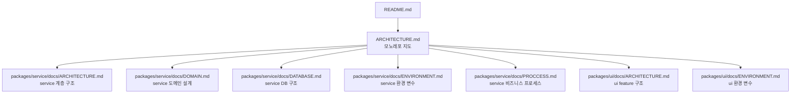
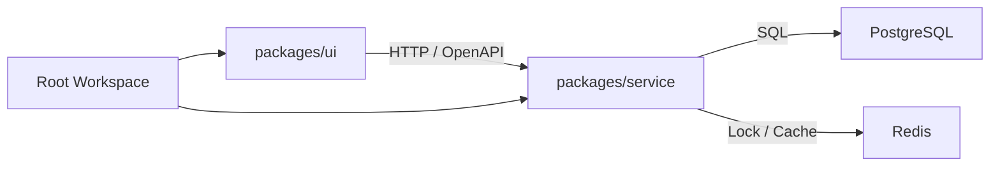

# GC Project 모노레포 구조

GC Project는 pnpm workspace 기반 영화 예매 서비스 모노레포입니다. 루트 문서는 package 경계와 문서 진입점만 설명하고, service와 ui의 세부 구조는 각 package 문서에서 관리합니다.

## 문서 흐름

## Package 구성

| 경로 | 역할 | 상세 문서 |
|---|---|---|
| `packages/service` | NestJS 기반 백엔드 API와 worker | [Service 프로젝트 구조](packages/service/docs/ARCHITECTURE.md) |
| `packages/ui` | React 19 + Vite 기반 프론트엔드 | [UI 프로젝트 구조](packages/ui/docs/ARCHITECTURE.md) |
| `packages/service/docs/ENVIRONMENT.md` | service API/worker 환경 변수 | [Service 환경 변수 설정](packages/service/docs/ENVIRONMENT.md) |
| `packages/ui/docs/ENVIRONMENT.md` | UI Vite 환경 변수 | [UI 환경 변수 설정](packages/ui/docs/ENVIRONMENT.md) |
| `packages/service/docs/DOMAIN.md` | 영화 예매 도메인 설계 | [Service 도메인 설계](packages/service/docs/DOMAIN.md) |
| `docker-compose.yml` | 로컬 PostgreSQL, Redis Sentinel 인프라 | [Service 데이터베이스 구조](packages/service/docs/DATABASE.md) |
| `package.json` | workspace 공통 실행 스크립트 | [Service 비즈니스 프로세스](packages/service/docs/PROCCESS.md) |

## 의존 경계

- `packages/ui`는 `packages/service`의 내부 TypeScript 구현을 직접 import하지 않습니다.
- `packages/service`는 UI에 의존하지 않습니다.
- 두 package의 계약은 HTTP API와 `packages/service/docs/openapi.json`을 기준으로 맞춥니다.
- 루트는 workspace, 인프라 실행, 공통 스크립트만 조율합니다.

## 루트 파일 역할

| 경로 | 역할 |
|---|---|
| `README.md` | 로컬 실행 준비와 주요 진입점. |
| `ARCHITECTURE.md` | 모노레포 package 경계와 문서 링크 허브. |
| `pnpm-workspace.yaml` | workspace package 범위 정의. |
| `.nvmrc` | Node.js 24 사용 기준. |
| `docker-compose.yml` | 로컬 인프라 구성. |
| `docker-compose.e2e.yml` | service e2e 테스트용 인프라 구성. |
| `scripts` | 루트 보조 스크립트. |

## 문서 소유 기준

- 루트 문서는 package 간 관계와 문서 흐름만 다룹니다.
- service 내부 계층, 비즈니스 프로세스, DB, outbox, 결제/예매 정합성은 `packages/service/docs`에 둡니다.
- ui feature 구조, 상태 관리, API client, 테스트 구조는 `packages/ui/docs`에 둡니다.
- 같은 설명이 루트와 package 문서에 중복되면 package 문서를 원천으로 보고 루트에서는 링크만 유지합니다.
