# 영화 예매 서비스 시스템 설계 문서

## 1. 개요

영화 예매 서비스의 핵심 도메인 설계 문서입니다. 회원 가입부터 영화 조회, 좌석 선택, 예매, 결제, 이력 관리까지의 흐름을 다루며 동시성이 높은 좌석 점유 처리를 위해 Redis와 DB를 조합한 복합 방식을 채택합니다.

### 1.1 핵심 도메인

- 회원 (Member)
- 영화 (Movie)
- 영화 이미지 (Movie Image)
- 극장 (Theater)
- 상영관 / 좌석 (Screen / Seat)
- 상영 일정 (Screening)
- 예매 (Reservation)
- 좌석 점유 (Seat Hold) — Redis + DB 복합
- 예매 이벤트 기록 (Reservation Event)
- 결제 (Payment)
- 결제 이벤트 로그 (Payment Event Log)
- 아웃박스 이벤트 (Outbox Event)

### 1.2 기술 스택

- RDB: **PostgreSQL 15+**
- Cache / Lock: Redis
- 애플리케이션: NestJS

### 1.3 바운디드 컨텍스트

영화 예매 서비스는 기능 단위가 아니라 도메인 언어와 책임 경계를 기준으로 바운디드 컨텍스트를 나눕니다. 특히 `member`와 `payment`는 다른 도메인에서 참조는 가능하지만 내부 정책을 공유하지 않는 독립 컨텍스트로 관리해야 합니다.

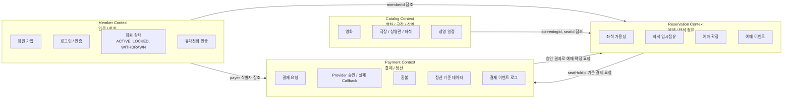

| 컨텍스트 | 책임 | 소유 데이터 | 외부에 노출하는 식별자/계약 |
|---|---|---|---|
| Member Context | 인증, 회원 가입, 회원 상태, 휴대전화 인증 | `member`, `phone_verification` | `memberId`, 인증 토큰, 회원 상태 |
| Catalog Context | 영화, 이미지, 극장, 상영관, 물리 좌석, 상영 일정 조회 | `movie`, `movie_image`, `theater`, `screen`, `seat`, `screening` | `movieId`, `screeningId`, `seatId` |
| Reservation Context | 좌석 가용성, 좌석 임시점유, 예매 확정/취소, 예매 이력 | `seat_hold`, `reservation`, `reservation_seat`, `reservation_event` | `seatHoldId`, `reservationId`, `reservationNumber` |
| Payment Context | 결제 요청, PG callback 처리, 환불, 결제 감사 로그, 정산 기준 데이터 | `payment`, `payment_event_log`, 결제/환불 outbox | `paymentId`, `providerPaymentId`, 결제 상태, 정산 이벤트 |

**Member Context 분리 원칙**

- 회원 인증/회원 도메인은 `member` 컨텍스트에서만 회원 상태 전이, 비밀번호 검증, 로그인 실패 잠금, 휴대전화 인증 정책을 소유합니다.
- 예매와 결제 컨텍스트는 회원 상세 정보나 인증 정책을 직접 변경하지 않고, 인증된 요청의 `memberId`와 필요한 최소 상태만 참조합니다.
- 회원 탈퇴, 잠금, 휴면 같은 정책 변경은 Member Context의 도메인 이벤트 또는 조회 계약을 통해 다른 컨텍스트에 전달합니다.

**Opaque Token 선택 이유**

- 현재 인증 토큰은 JWT가 아니라 Opaque token을 사용합니다. Access token은 Redis에 저장하고, Refresh token은 DB에 저장합니다.
- 토큰 생성은 단일 `OpaqueTokenGenerator`로 통일하고, 저장은 `TokenRepository`가 `TokenType.ACCESS`는 Redis repository, `TokenType.REFRESH`는 DB repository로 분기합니다. TTL은 `ACCESS_TOKEN_TTL_SECONDS`, `REFRESH_TOKEN_TTL_SECONDS` 환경변수에서 주입받습니다.
- Opaque token은 서버 저장소에서 토큰 상태를 조회하므로 로그아웃, 회원탈퇴, 관리자 강제 만료 같은 이벤트가 발생하면 즉시 세션을 만료할 수 있습니다. JWT는 자체 서명 토큰 특성상 만료 시간 전까지 이미 발급된 토큰을 즉시 무효화하려면 별도의 denylist나 세션 저장소가 필요합니다.
- 현재 서비스는 분산된 마이크로서비스 구조가 아니며, 단일 service가 인증과 업무 API를 함께 처리합니다. 따라서 모든 요청이 같은 인증 저장소를 조회해도 서비스 간 공개키 배포, 토큰 클레임 동기화, clock skew 조정 같은 JWT 운영 복잡도를 감수할 필요가 없습니다.
- 추후 Gateway를 도입하거나 Member, Reservation, Payment 서비스가 분리되면 Gateway 또는 Auth 서비스가 Opaque token을 검증한 뒤 내부 통신용 JWT로 변환하는 구조로 확장할 수 있습니다. 이때 외부 클라이언트 계약은 유지하면서 내부 서비스 간 인증만 JWT 기반으로 전환할 수 있습니다.

**Payment Context 분리 원칙**

- `payment`는 단순 예매 하위 기능이 아니라 결제/정산 컨텍스트로 분리합니다.
- Payment Context는 결제 요청 멱등성, provider 거래 ID, callback 검증, 환불, 결제 이벤트 로그, 정산에 필요한 금액/상태 기준 데이터를 소유합니다.
- Reservation Context는 좌석 점유와 예매 확정의 진실을 소유하고, Payment Context는 `seatHoldId`를 기준으로 결제 가능 여부를 검증한 뒤 승인 결과를 통해 예매 확정을 요청합니다.
- 정산 데이터는 예매 테이블에서 역산하지 않고, Payment Context의 결제 이벤트와 provider 거래 정보를 기준으로 생성합니다.

**컨텍스트 간 의존 규칙**

- 다른 컨텍스트의 테이블을 직접 UPDATE하지 않습니다. 필요한 변경은 application command, domain event, outbox event를 통해 요청합니다.
- 컨텍스트 간 참조는 내부 객체 전체가 아니라 `memberId`, `screeningId`, `seatHoldId`, `paymentId` 같은 안정적인 식별자로 제한합니다.
- 외부 PG 연동, 환불, 정산 같은 부수효과는 Payment Context의 port/adapter 뒤에 두고 Reservation Context가 PG 구현체를 알지 않도록 합니다.

---

## 2. 도메인 관계도

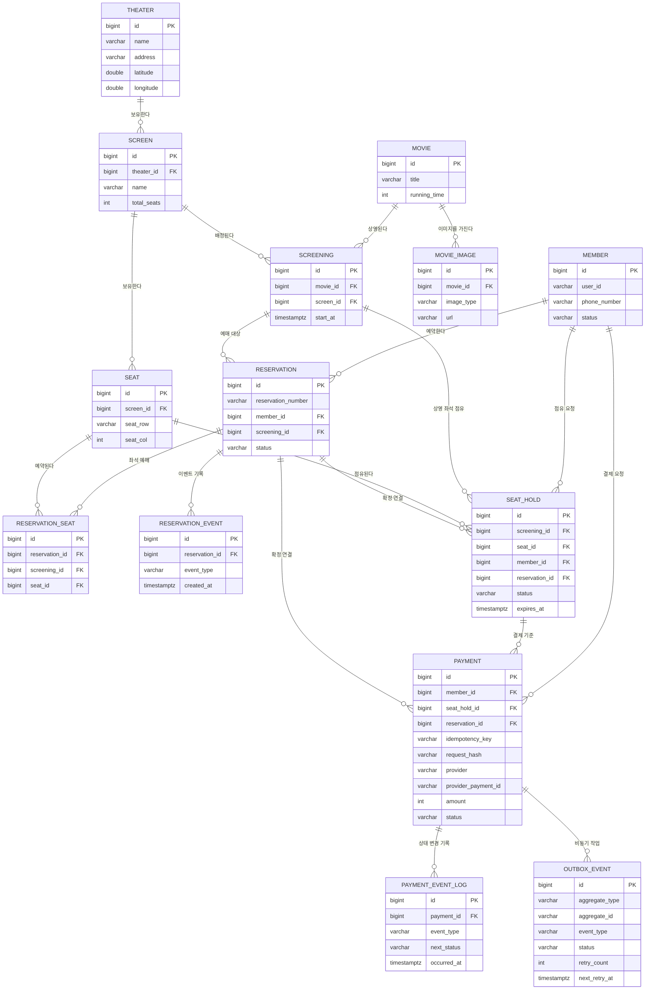

---

## 3. 테이블 설계

> PostgreSQL 컨벤션에 맞춰 `BIGSERIAL`(또는 `GENERATED ALWAYS AS IDENTITY`), `TIMESTAMPTZ`, `JSONB` 등을 사용합니다. 시간 컬럼은 타임존을 포함한 `TIMESTAMPTZ`로 통일합니다.

### 3.1 member (회원)

| 컬럼 | 타입 | 제약 | 설명 |
|---|---|---|---|
| id | BIGSERIAL | PK | 회원 ID |
| user_id | VARCHAR(30) | UNIQUE, NOT NULL | 로그인 ID |
| password_hash | VARCHAR(255) | NOT NULL | 암호화된 비밀번호 |
| name | VARCHAR(50) | NOT NULL | 이름 |
| birth_date | DATE | NOT NULL | 생년월일 |
| phone_number | VARCHAR(20) | UNIQUE, NOT NULL | 휴대폰 번호 |
| address | VARCHAR(255) | NOT NULL | 주소 |
| status | VARCHAR(20) | NOT NULL | ACTIVE, LOCKED 등 |
| failed_login_count | INT | NOT NULL DEFAULT 0 | 로그인 실패 횟수 |
| locked_at | TIMESTAMPTZ | | 잠금 일시 |
| created_at | TIMESTAMPTZ | NOT NULL DEFAULT now() | 가입일시 |
| updated_at | TIMESTAMPTZ | NOT NULL DEFAULT now() | 수정일시 |

### 3.2 movie (영화)

| 컬럼 | 타입 | 제약 | 설명 |
|---|---|---|---|
| id | BIGSERIAL | PK | 영화 ID |
| title | VARCHAR(200) | NOT NULL | 제목 |
| director | VARCHAR(100) | | 감독 |
| genre | VARCHAR(50) | | 장르 |
| running_time | INT | NOT NULL | 상영시간(분) |
| rating | VARCHAR(20) | | 관람등급 (ALL, 12, 15, 19) |
| release_date | DATE | | 개봉일 |
| poster_url | VARCHAR(500) | | 포스터 이미지 URL |
| description | TEXT | | 줄거리 |
| created_at | TIMESTAMPTZ | NOT NULL DEFAULT now() | 등록일시 |

### 3.3 movie_image (영화 이미지)

| 컬럼 | 타입 | 제약 | 설명 |
|---|---|---|---|
| id | BIGSERIAL | PK | 영화 이미지 ID |
| movie_id | BIGINT | FK → movie.id, NOT NULL | 영화 ID |
| image_type | VARCHAR(20) | NOT NULL | POSTER, STILL |
| url | VARCHAR(500) | NOT NULL | 이미지 URL |
| sort_order | INT | NOT NULL DEFAULT 0 | 노출 순서 |
| created_at | TIMESTAMPTZ | NOT NULL DEFAULT now() | 등록일시 |

**인덱스:**

```sql
CREATE INDEX idx_movie_image_movie_type_order
  ON movie_image (movie_id, image_type, sort_order);
```

`movie.poster_url`은 기존 목록 API 호환용 대표 포스터 필드입니다. 신규 이미지 확장은 `movie_image`를 기준으로 저장하며, 목록 조회에서는 `movie_image`의 `POSTER`를 우선 사용합니다.

### 3.4 theater (극장)

| 컬럼 | 타입 | 제약 | 설명 |
|---|---|---|---|
| id | BIGSERIAL | PK | 극장 ID |
| name | VARCHAR(100) | UNIQUE, NOT NULL | 극장명 |
| address | VARCHAR(255) | NOT NULL | 극장 주소 |
| latitude | DOUBLE PRECISION | | 위도 |
| longitude | DOUBLE PRECISION | | 경도 |
| created_at | TIMESTAMPTZ | NOT NULL DEFAULT now() | 등록일시 |

### 3.5 screen (상영관)

| 컬럼 | 타입 | 제약 | 설명 |
|---|---|---|---|
| id | BIGSERIAL | PK | 상영관 ID |
| theater_id | BIGINT | FK → theater.id, NOT NULL | 극장 ID |
| name | VARCHAR(50) | NOT NULL | 상영관명 (1관, IMAX 등) |
| total_seats | INT | NOT NULL | 총 좌석 수 |

### 3.6 seat (좌석)

| 컬럼 | 타입 | 제약 | 설명 |
|---|---|---|---|
| id | BIGSERIAL | PK | 좌석 ID |
| screen_id | BIGINT | FK → screen.id | 상영관 ID |
| seat_row | VARCHAR(5) | NOT NULL | 행 (A, B, C...) |
| seat_col | INT | NOT NULL | 열 (1, 2, 3...) |
| seat_type | VARCHAR(20) | | NORMAL, COUPLE, DISABLED |

**제약:** `UNIQUE (screen_id, seat_row, seat_col)`

### 3.7 screening (상영 일정)

| 컬럼 | 타입 | 제약 | 설명 |
|---|---|---|---|
| id | BIGSERIAL | PK | 상영 ID |
| movie_id | BIGINT | FK → movie.id | 영화 ID |
| screen_id | BIGINT | FK → screen.id | 상영관 ID |
| start_at | TIMESTAMPTZ | NOT NULL | 시작 시각 |
| end_at | TIMESTAMPTZ | NOT NULL | 종료 시각 |
| price | INT | NOT NULL | 기본 가격 |

### 3.8 reservation (예매)

| 컬럼 | 타입 | 제약 | 설명 |
|---|---|---|---|
| id | BIGSERIAL | PK | 예매 ID |
| reservation_number | VARCHAR(20) | UNIQUE, NOT NULL | 예매번호 (예: R20260428001) |
| member_id | BIGINT | FK → member.id | 회원 ID |
| screening_id | BIGINT | FK → screening.id | 상영 ID |
| status | VARCHAR(20) | NOT NULL | PENDING, CONFIRMED, CANCELED, EXPIRED |
| total_price | INT | NOT NULL | 총 결제 금액 |
| canceled_at | TIMESTAMPTZ | NULL | 취소 일시 |
| cancel_reason | VARCHAR(100) | NULL | 취소 사유 |
| created_at | TIMESTAMPTZ | NOT NULL DEFAULT now() | 예매일시 |

**인덱스:**

```sql
CREATE INDEX idx_reservation_member_created
  ON reservation (member_id, created_at DESC);

CREATE INDEX idx_reservation_member_status
  ON reservation (member_id, status, created_at DESC);
```

### 3.9 reservation_seat (예매-좌석 매핑)

| 컬럼 | 타입 | 제약 | 설명 |
|---|---|---|---|
| id | BIGSERIAL | PK | |
| reservation_id | BIGINT | FK → reservation.id | 예매 ID |
| screening_id | BIGINT | FK → screening.id | 상영 ID |
| seat_id | BIGINT | FK → seat.id | 좌석 ID |

**핵심 제약:** `UNIQUE (screening_id, seat_id)` — 같은 상영의 같은 좌석 중복 예매 방지 (DB 레벨 최후 방어선)

### 3.10 seat_hold (좌석 점유 이력)

| 컬럼 | 타입 | 제약 | 설명 |
|---|---|---|---|
| id | BIGSERIAL | PK | |
| screening_id | BIGINT | FK, NOT NULL | 상영 ID |
| seat_id | BIGINT | FK, NOT NULL | 좌석 ID |
| member_id | BIGINT | FK, NOT NULL | 점유한 회원 |
| reservation_id | BIGINT | FK, NULL | 예매 확정 시 연결 |
| status | VARCHAR(20) | NOT NULL | HELD, CONFIRMED, EXPIRED, RELEASED |
| expires_at | TIMESTAMPTZ | NOT NULL | 만료 예정 시각 |
| created_at | TIMESTAMPTZ | NOT NULL DEFAULT now() | 점유 시작 |
| updated_at | TIMESTAMPTZ | NOT NULL DEFAULT now() | |

**중요:** 이력 테이블이므로 `UNIQUE (screening_id, seat_id)` 제약을 걸지 않습니다. 같은 좌석에 대한 여러 점유 시도가 시간차로 누적되는 게 정상입니다 (HELD → EXPIRED → 다른 회원 HELD → CONFIRMED).

**인덱스 (PostgreSQL 부분 인덱스 활용):**

PostgreSQL은 부분 인덱스(Partial Index)를 지원하므로 `HELD` 상태만 인덱싱해 효율을 높일 수 있습니다.

```sql
-- 회원의 진행 중인 점유 조회
CREATE INDEX idx_hold_member_status
  ON seat_hold (member_id, status, created_at DESC);

-- 활성 점유만 인덱싱 (대부분의 조회는 HELD 상태)
CREATE INDEX idx_hold_screening_active
  ON seat_hold (screening_id)
  WHERE status = 'HELD';

-- 만료 처리 스케줄러용 (HELD 만료 대상만)
CREATE INDEX idx_hold_expires_active
  ON seat_hold (expires_at)
  WHERE status = 'HELD';
```

### 3.11 reservation_event (예매 이벤트 기록)

| 컬럼 | 타입 | 제약 | 설명 |
|---|---|---|---|
| id | BIGSERIAL | PK | |
| reservation_id | BIGINT | FK → reservation.id, NOT NULL | 예매 ID |
| event_type | VARCHAR(30) | NOT NULL | CREATED, CONFIRMED, CANCELED, EXPIRED |
| description | VARCHAR(255) | | 부가 설명 (취소 사유 등) |
| created_at | TIMESTAMPTZ | NOT NULL DEFAULT now() | 발생 시각 |

**인덱스:**

```sql
CREATE INDEX idx_reservation_event
  ON reservation_event (reservation_id, created_at);
```

**event_type 값:**

- `CREATED` — 예매 생성
- `CONFIRMED` — 결제 완료/확정
- `CANCELED` — 사용자 취소
- `EXPIRED` — 만료 처리

### 3.12 phone_verification (휴대전화 인증)

| 컬럼 | 타입 | 제약 | 설명 |
|---|---|---|---|
| id | BIGSERIAL | PK | 인증 요청 ID |
| phone_number | VARCHAR(20) | NOT NULL | 휴대전화번호 |
| code | VARCHAR(6) | NOT NULL | 인증 코드 |
| status | VARCHAR(20) | NOT NULL | PENDING, VERIFIED, EXPIRED |
| expires_at | TIMESTAMPTZ | NOT NULL | 만료 일시 |
| verified_at | TIMESTAMPTZ | | 인증 완료 일시 |
| created_at | TIMESTAMPTZ | NOT NULL DEFAULT now() | 생성 일시 |
| updated_at | TIMESTAMPTZ | NOT NULL DEFAULT now() | 수정 일시 |

**인덱스:**

```sql
CREATE INDEX idx_phone_verification_phone_status
  ON phone_verification (phone_number, status);
```

### 3.13 payment (결제)

| 컬럼 | 타입 | 제약 | 설명 |
|---|---|---|---|
| id | BIGSERIAL | PK | 결제 ID |
| member_id | BIGINT | FK → member.id, NOT NULL | 결제 요청 회원 |
| seat_hold_id | BIGINT | FK → seat_hold.id, NOT NULL | 결제 기준 좌석 점유 |
| idempotency_key | VARCHAR(100) | NOT NULL | 결제 요청 멱등성 키 |
| request_hash | VARCHAR(64) | NOT NULL | 동일 멱등성 키의 요청 본문 비교용 SHA-256 해시 |
| reservation_id | BIGINT | FK → reservation.id | 결제 승인 후 생성된 예매 |
| provider | VARCHAR(20) | NOT NULL | LOCAL, KAKAO, TOSS, NAVER 등 |
| provider_payment_id | VARCHAR(100) | | PG사 결제 ID |
| amount | INT | NOT NULL | 결제 금액 |
| status | VARCHAR(30) | NOT NULL | PENDING, APPROVING, APPROVED, FAILED, REFUND_REQUIRED, REFUNDING, REFUNDED, REFUND_FAILED |
| requested_at | TIMESTAMPTZ | NOT NULL | 결제 요청 시각 |
| approved_at | TIMESTAMPTZ | | 승인 완료 시각 |
| failed_at | TIMESTAMPTZ | | 실패 시각 |
| refunded_at | TIMESTAMPTZ | | 환불 완료 시각 |
| failure_reason | VARCHAR(255) | | 실패 또는 환불 필요 사유 |
| created_at | TIMESTAMPTZ | NOT NULL DEFAULT now() | 생성 시각 |
| updated_at | TIMESTAMPTZ | NOT NULL DEFAULT now() | 수정 시각 |

**인덱스 / 제약:**

```sql
CREATE INDEX idx_payment_member_created
  ON payment (member_id, created_at DESC);

CREATE INDEX idx_payment_seat_hold
  ON payment (seat_hold_id);

ALTER TABLE payment
  ADD CONSTRAINT uq_payment_member_idempotency_key
  UNIQUE (member_id, idempotency_key);

ALTER TABLE payment
  ADD CONSTRAINT uq_payment_provider_payment_id
  UNIQUE (provider, provider_payment_id);
```

### 3.14 payment_event_log (결제 이벤트 로그)

| 컬럼 | 타입 | 제약 | 설명 |
|---|---|---|---|
| id | BIGSERIAL | PK | 결제 이벤트 로그 ID |
| payment_id | BIGINT | FK → payment.id, NOT NULL | 결제 ID |
| event_type | VARCHAR(50) | NOT NULL | PAYMENT_REQUESTED, PAYMENT_APPROVED 등 |
| previous_status | VARCHAR(30) | | 이전 결제 상태 |
| next_status | VARCHAR(30) | NOT NULL | 변경 후 결제 상태 |
| provider | VARCHAR(20) | NOT NULL | 결제 provider |
| provider_payment_id | VARCHAR(100) | | PG사 결제 ID |
| amount | INT | NOT NULL | 결제 금액 |
| reason | VARCHAR(255) | | 상태 변경 사유 |
| metadata | JSONB | | 추가 감사 정보 |
| occurred_at | TIMESTAMPTZ | NOT NULL | 이벤트 발생 시각 |
| created_at | TIMESTAMPTZ | NOT NULL DEFAULT now() | 저장 시각 |

```sql
CREATE INDEX idx_payment_event_log_payment_created
  ON payment_event_log (payment_id, created_at);
```

### 3.15 outbox_event (아웃박스 이벤트)

| 컬럼 | 타입 | 제약 | 설명 |
|---|---|---|---|
| id | BIGSERIAL | PK | 아웃박스 이벤트 ID |
| aggregate_type | VARCHAR(50) | NOT NULL | PAYMENT, RESERVATION 등 |
| aggregate_id | VARCHAR(50) | NOT NULL | aggregate 식별자 |
| event_type | VARCHAR(80) | NOT NULL | PAYMENT_REQUESTED, PAYMENT_REFUND_REQUESTED 등 |
| payload | JSONB | NOT NULL | worker 처리 payload |
| status | VARCHAR(20) | NOT NULL | PENDING, PROCESSING, PUBLISHED, FAILED |
| retry_count | INT | NOT NULL | 재시도 횟수 |
| next_retry_at | TIMESTAMPTZ | | 다음 재시도 가능 시각 |
| locked_until | TIMESTAMPTZ | | worker 처리 잠금 만료 시각 |
| last_error | VARCHAR(500) | | 마지막 실패 사유 |
| occurred_at | TIMESTAMPTZ | NOT NULL | 이벤트 발생 시각 |
| published_at | TIMESTAMPTZ | | 발행 완료 시각 |
| created_at | TIMESTAMPTZ | NOT NULL DEFAULT now() | 생성 시각 |
| updated_at | TIMESTAMPTZ | NOT NULL DEFAULT now() | 수정 시각 |

```sql
CREATE INDEX idx_outbox_publishable
  ON outbox_event (status, next_retry_at, occurred_at);

CREATE INDEX idx_outbox_aggregate
  ON outbox_event (aggregate_type, aggregate_id);
```

> **선택 사항:** `event_type`은 `VARCHAR` 대신 PostgreSQL의 `ENUM` 타입으로 정의할 수도 있습니다. 다만 ENUM은 값 추가 시 `ALTER TYPE`이 필요해 운영 유연성이 떨어지므로, `VARCHAR + CHECK 제약` 또는 단순 `VARCHAR`를 권장합니다.

```sql
-- CHECK 제약으로 값 범위 보장 (선택)
ALTER TABLE reservation_event
  ADD CONSTRAINT chk_event_type
  CHECK (event_type IN ('CREATED', 'CONFIRMED', 'CANCELED', 'EXPIRED'));
```

---

## 4. 좌석 점유 설계 (복합 방식)

### 4.1 역할 분담

| 역할 | 저장소 | 목적 |
|---|---|---|
| 실시간 점유 락 | Redis | 좌석 클릭 순간의 동시성 차단, TTL 자동 만료 |
| 점유 이력 | DB (seat_hold) | 누가 언제 어떤 좌석을 점유했는지 기록, CS/분석용 |

**핵심 원칙:** Redis는 진실의 원천(source of truth), DB는 기록(log)

### 4.2 Redis 키 구조

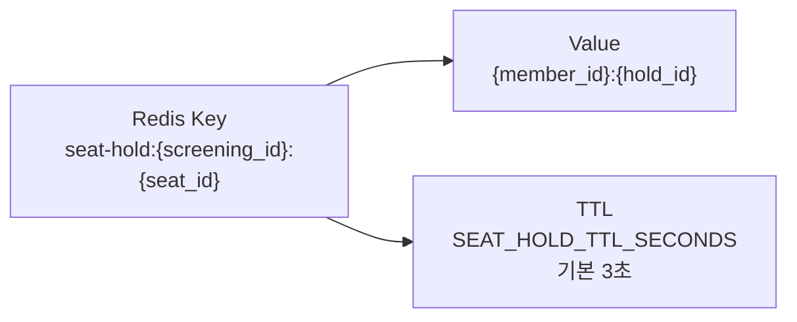

`hold_id`를 함께 저장하면 락 해제 시 DB 레코드를 바로 찾을 수 있습니다.

**상영별 점유 좌석 조회 최적화:** `KEYS` 명령은 운영에서 위험하므로 상영별 SET을 별도로 둡니다.

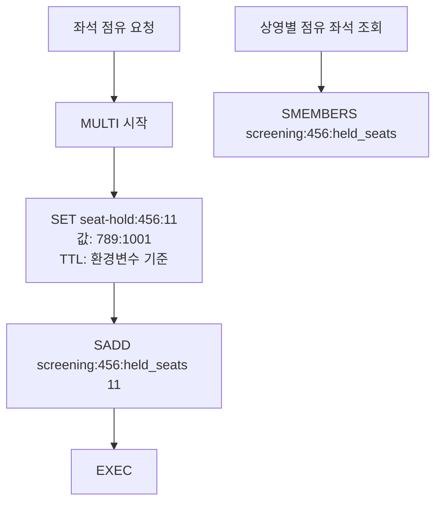

SET 멤버는 개별 TTL이 적용되지 않으므로 만료 처리 시 SREM으로 함께 제거해야 합니다.

### 4.3 좌석 가용 여부 조회

확정된 예매(DB) + 진행 중인 점유(Redis) 둘 다 확인합니다.

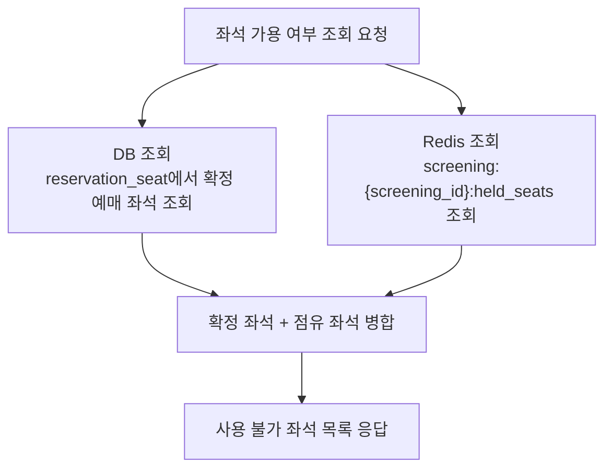

### 4.4 PostgreSQL 단독 fallback (Redis 장애 시)

Redis 장애 시를 대비해 PostgreSQL의 `SELECT ... FOR UPDATE SKIP LOCKED`를 활용한 비관적 락 fallback이 가능합니다.

```sql
BEGIN;

-- 점유 가능 여부를 잠그며 확인
SELECT id FROM seat_hold
 WHERE screening_id = $1
   AND seat_id = $2
   AND status = 'HELD'
   AND expires_at > now()
 FOR UPDATE SKIP LOCKED;

-- 결과 없으면 INSERT 진행
INSERT INTO seat_hold (...) VALUES (...);

COMMIT;
```

`SKIP LOCKED`는 잠긴 행을 건너뛰므로 동시 요청 시 대기 없이 빠르게 실패 처리할 수 있어 큐 처리나 좌석 점유 같은 시나리오에 적합합니다.

### 4.5 동작 흐름

**좌석 선택**

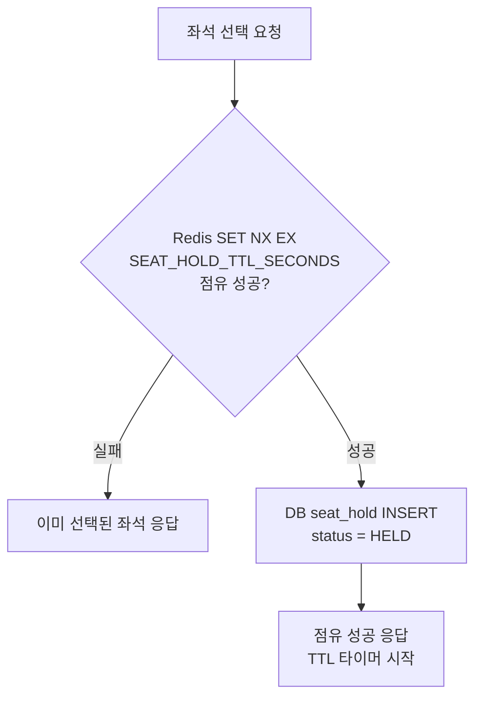

**결제 완료 (예매 확정)**

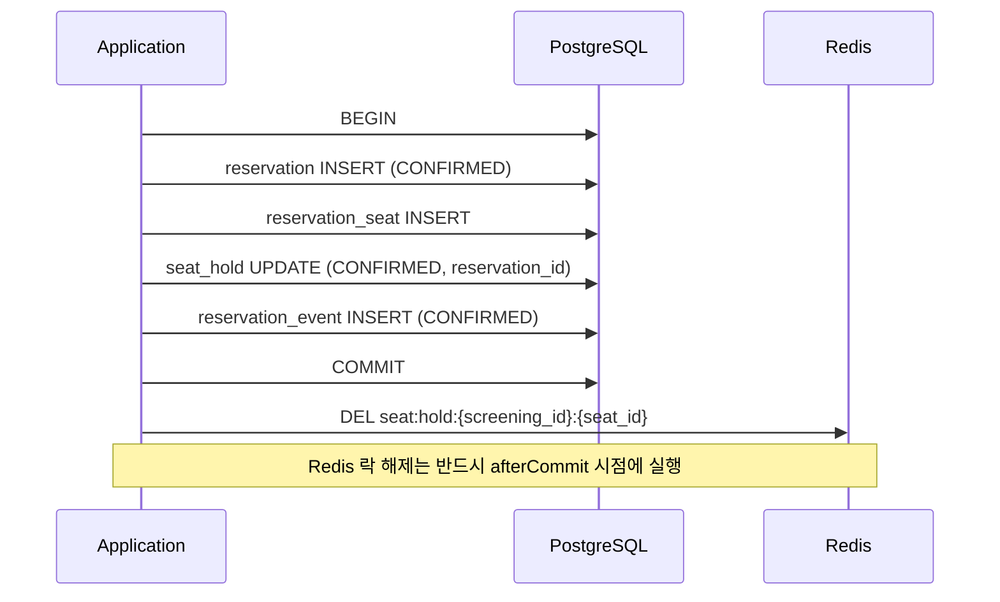

**결제 / 환불 프로세스**

결제는 PG별 구현체에 직접 의존하지 않고, `PaymentGatewayPort` 뒤에 local/kakao/toss/naver adapter를 배치합니다. 결제 요청은 `member_id + idempotency_key`로 멱등성을 보장하고, 동일 키로 다른 요청이 들어오는지 `request_hash`로 검증합니다. 결제 상태 변경, 결제 이벤트 로그, 아웃박스 이벤트 저장은 같은 DB 트랜잭션으로 처리하고, 외부 PG 호출이나 환불 요청 같은 부수효과는 outbox worker가 처리합니다.

현재 구현된 결제 API는 다음과 같습니다.

| API | 인증 | 설명 |
|---|---|---|
| `POST /payments` | 회원 인증 필요 | 본인이 점유한 좌석 기준으로 결제 요청을 생성 |
| `GET /payments/:paymentId` | 회원 인증 필요 | 본인 결제 상세 조회 |
| `POST /payments/callback` | provider callback | PG/local 결제 승인 또는 실패 callback 처리 |
| `POST /payments/:paymentId/refund` | 내부/운영 보강 필요 | 환불 필요 상태의 결제를 provider adapter로 환불 |

**결제 요청 멱등성**

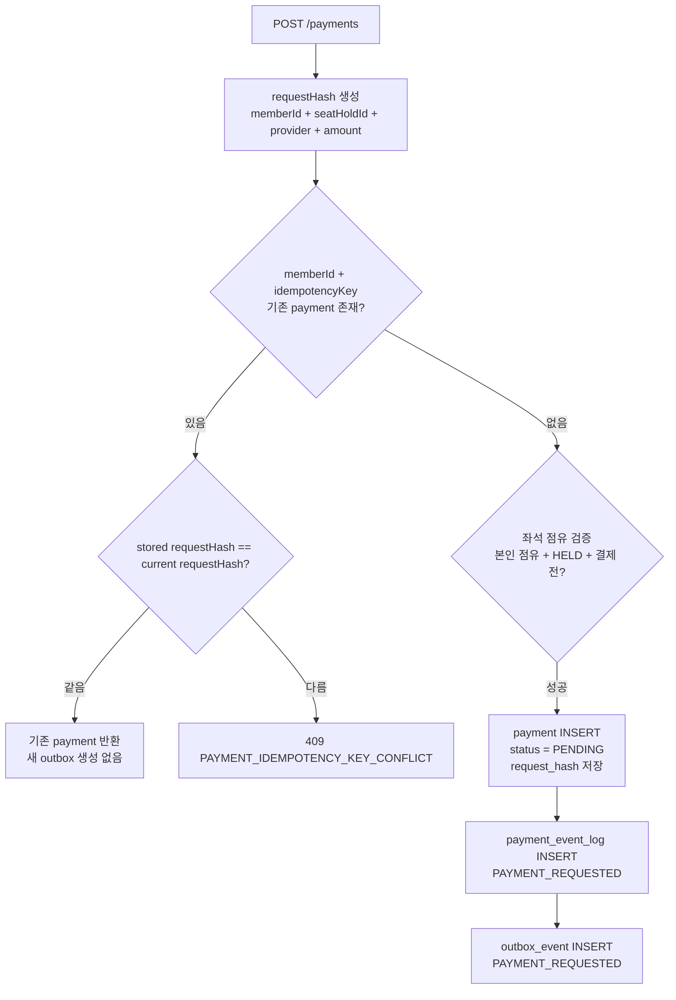

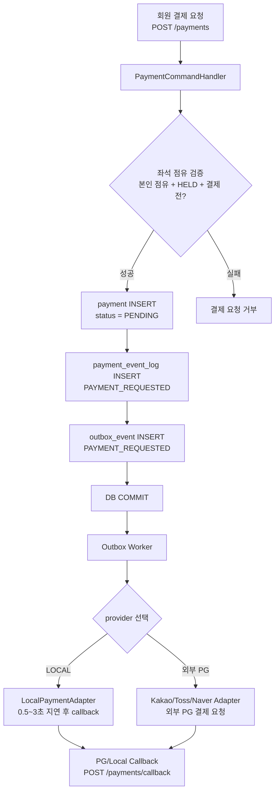

`LocalPaymentGateway`는 `providerPaymentId`와 `local:{paymentId}:{providerPaymentId}` 형식의 callback token을 생성합니다. 이후 `LOCAL_PAYMENT_CALLBACK_URL`이 있으면 해당 주소로, 없으면 `http://localhost:${PORT}/payments/callback`으로 지연 callback을 전송합니다.

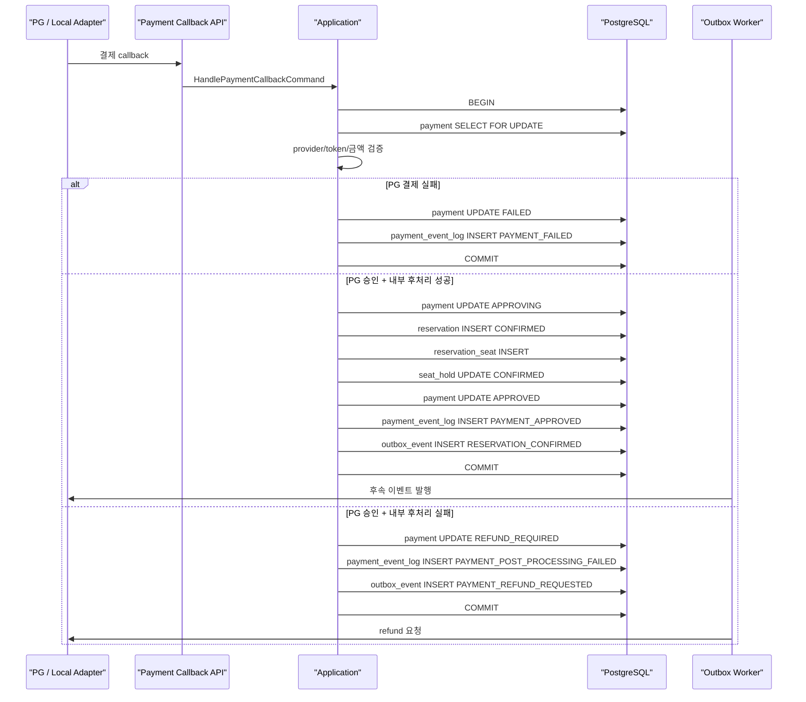

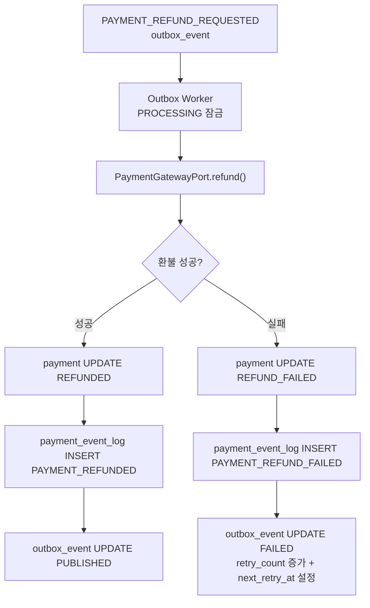

**점유 만료 / 취소**

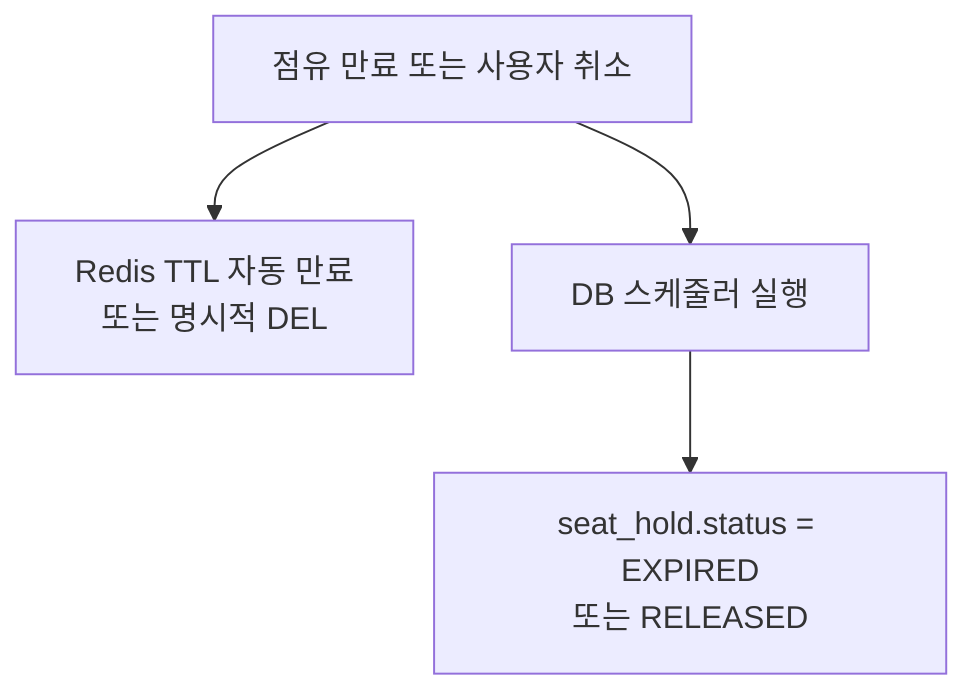

### 4.6 결제 이벤트 로그와 아웃박스

결제 건은 상태 변경 이력과 비동기 후속 작업을 분리해서 저장합니다.

- `payment_event_log`: 결제 감사 로그. append-only로 저장하며 운영자가 결제 상태 변경 원인을 추적할 수 있어야 합니다.
- `outbox_event`: 시스템이 처리해야 하는 비동기 작업. callback 예약, 환불 요청, 예약 확정 이벤트 발행 등 재시도 가능한 작업을 저장합니다.
- 결제 상태 변경, 결제 이벤트 로그, 아웃박스 이벤트는 반드시 같은 DB 트랜잭션으로 커밋합니다.
- PG 승인 후 예약 생성이나 좌석 확정이 실패하면 `REFUND_REQUIRED`로 상태를 전환하고 `PAYMENT_REFUND_REQUESTED` 아웃박스 이벤트를 남깁니다.
- worker는 발행 가능한 outbox를 `PROCESSING`으로 잠근 뒤 성공 시 `PUBLISHED`, 실패 시 `FAILED`와 `retry_count`, `next_retry_at`, `last_error`를 갱신합니다.

주요 결제 이벤트 타입은 `PAYMENT_REQUESTED`, `PAYMENT_CALLBACK_APPROVED`, `PAYMENT_APPROVED`, `PAYMENT_FAILED`, `PAYMENT_POST_PROCESSING_FAILED`, `PAYMENT_REFUNDED`, `PAYMENT_REFUND_FAILED`입니다. 주요 outbox 이벤트 타입은 `PAYMENT_REQUESTED`, `PAYMENT_REFUND_REQUESTED`, `RESERVATION_CONFIRMED`입니다.

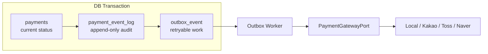

**현재 outbox worker 구조**

현재 구현은 메시지 브로커 없이 **DB outbox + polling worker**로 구성합니다. 핵심은 비즈니스 상태 변경과 이벤트 발행 의도를 같은 DB 트랜잭션에 저장하고, 별도 worker 프로세스가 `outbox_event`를 주기적으로 조회해 재시도 가능한 후속 작업을 처리하는 것입니다.

관련 파일은 다음과 같습니다.

| 영역 | 파일 | 역할 |
|---|---|---|
| API app | `packages/service/src/api-app.module.ts` | HTTP API, presentation/application 모듈 구성 |
| API main | `packages/service/src/api-main.ts` | API 프로세스 bootstrap, Swagger, global pipe/interceptor, migration 실행 |
| Worker app | `packages/service/src/worker-app.module.ts` | `.env-worker` 로드, warning/error 로그 레벨, outbox worker 모듈 구성 |
| Worker main | `packages/service/src/worker-main.ts` | worker 프로세스 bootstrap |
| Outbox worker module | `packages/service/src/infrastructure/outbox/outbox-worker.module.ts` | worker provider 조립 |
| Payment outbox worker | `packages/service/src/infrastructure/outbox/payment-outbox-worker.ts` | `outbox_event` polling, 처리 잠금, 발행, 실패 재시도 |

실행 명령은 API와 worker를 별도 프로세스로 분리합니다.

| 명령 | 설명 |
|---|---|
| `pnpm run service` | 빌드된 API 프로세스 실행 |
| `pnpm run worker` | 빌드된 worker 프로세스 실행 |
| `pnpm run service:all` | 빌드된 API와 worker를 병렬 실행 |
| `pnpm run dev:service` | API 개발 watch 실행 |
| `pnpm run dev:worker` | worker 개발 watch 실행 |
| `pnpm run dev:service:all` | API와 worker 개발 watch 병렬 실행 |

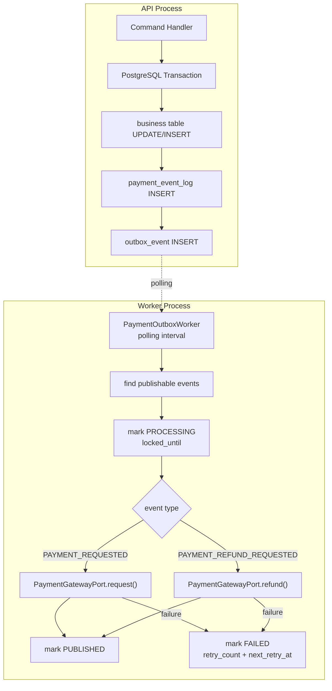

현재 구조의 운영 특성은 다음과 같습니다.

- `outbox_event`는 발행해야 할 의도를 저장하는 source of truth입니다.
- worker는 polling 기반으로 동작하며, 현재 기본 간격은 `PaymentOutboxWorker`의 `DEFAULT_PAYMENT_OUTBOX_WORKER_INTERVAL_MS = 500`입니다.
- worker는 `.env-worker`를 바라보고, 로그는 warning/error 중심으로 출력합니다.
- 같은 프로세스에서 API와 worker를 함께 띄우지 않고, 각자 별도 프로세스로 실행합니다.
- 실패한 이벤트는 `FAILED`, `retry_count`, `next_retry_at`, `last_error`를 남겨 재시도 대상이 됩니다.
- 현재 worker는 결제 요청과 환불 요청 같은 Payment Context 후속 작업을 직접 `PaymentGatewayPort`로 처리합니다.

**향후 메시지 브로커 확장 방향**

트래픽 증가, 소비자 다변화, 정산/알림/감사 로그 등 독립 consumer가 늘어나는 시점에는 메시지 브로커를 도입합니다. 이때도 outbox 패턴의 핵심은 유지합니다. 즉, API 트랜잭션은 여전히 비즈니스 상태와 `outbox_event`를 함께 저장하고, worker의 책임만 “직접 후속 작업 수행”에서 “브로커 publish”로 좁힙니다.

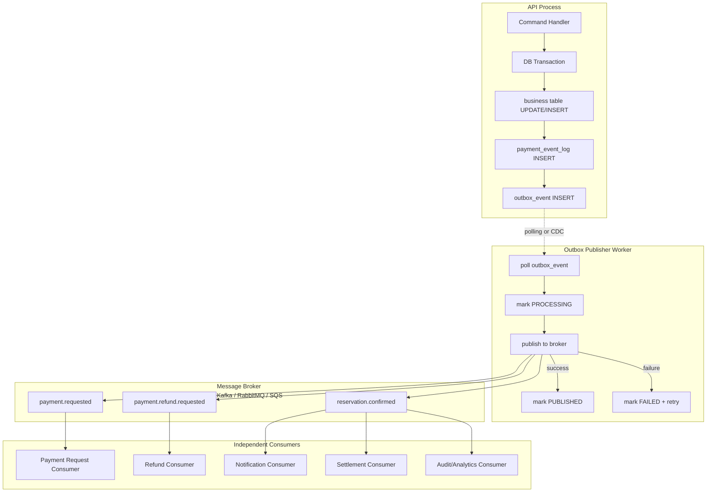

확장 시 설계 원칙은 다음과 같습니다.

- `outbox_event` 저장은 계속 DB 트랜잭션 안에서 수행합니다.
- broker publish는 outbox worker가 담당하고, API command handler는 broker client를 직접 호출하지 않습니다.
- consumer는 at-least-once delivery를 전제로 멱등하게 구현합니다.
- 이벤트에는 consumer 멱등 처리를 위한 안정적인 `eventId`, `aggregateType`, `aggregateId`, `eventType`, `occurredAt`을 포함합니다.
- provider 결제 요청, 환불, 알림, 정산, 분석 적재는 consumer 단위로 분리합니다.
- broker 장애 시 `outbox_event`는 `FAILED`와 `next_retry_at` 기준으로 재시도합니다.
- 다중 worker 확장이 필요하면 `FOR UPDATE SKIP LOCKED` 또는 동등한 잠금 전략을 적용합니다.
- PostgreSQL `LISTEN/NOTIFY`는 polling 지연을 줄이는 wake-up 최적화로 사용할 수 있지만, 최종 source of truth는 여전히 `outbox_event`입니다.
- 더 큰 규모에서는 Debezium 같은 CDC 기반 outbox relay를 검토할 수 있습니다.

단계별 전환안은 다음과 같습니다.

| 단계 | 구조 | 적용 시점 |
|---|---|---|
| 1단계 | DB outbox + polling worker가 직접 adapter 호출 | 현재 구조. 운영 부담을 낮추고 결제/환불 재시도 보장 |
| 2단계 | DB outbox + polling publisher + broker + consumer | 결제/환불/알림/정산 consumer가 분리될 때 |
| 3단계 | DB outbox + CDC relay + broker + consumer | polling 부하와 지연을 줄이고 이벤트 처리량이 커질 때 |

### 4.7 정합성 보장 포인트

**결제 완료 시 원자성**

Redis 락 해제는 반드시 DB 트랜잭션 **커밋 후**에 실행해야 합니다. 그렇지 않으면 DB 롤백 시 락이 풀려 다른 사용자가 같은 좌석을 점유하는 사고가 발생할 수 있습니다.

```java
@Transactional
public void confirmReservation(...) {
    // 1. DB 작업
    reservationSeatRepository.saveAll(...);
    seatHoldRepository.updateStatus(holdIds, CONFIRMED);

    // 2. 트랜잭션 커밋 후 Redis 락 해제
    TransactionSynchronizationManager.registerSynchronization(
        new TransactionSynchronization() {
            @Override
            public void afterCommit() {
                redisTemplate.delete(keys);
            }
        }
    );
}
```

**Redis-DB 불일치 복구**

드물게 "Redis 락 획득 후 DB INSERT 실패" 같은 상황이 발생할 수 있습니다. 보정 방안:

- Redis 락 획득과 DB 작업을 같은 트랜잭션 흐름에 배치
- 보정 스케줄러: DB가 HELD인데 Redis에 키가 없는 레코드를 주기적으로 EXPIRED 처리

**최후의 방어선**

`reservation_seat`의 `UNIQUE (screening_id, seat_id)` 제약은 모든 동시성 제어가 실패해도 **DB 레벨에서 중복 예매를 차단**하는 최후 방어선입니다. 절대 제거하지 마세요.

PostgreSQL에서는 `INSERT ... ON CONFLICT (screening_id, seat_id) DO NOTHING` 패턴으로 중복 예매를 깔끔하게 처리할 수 있습니다.

```sql
INSERT INTO reservation_seat (reservation_id, screening_id, seat_id)
VALUES ($1, $2, $3)
ON CONFLICT (screening_id, seat_id) DO NOTHING
RETURNING id;
```

`RETURNING`이 빈 결과면 중복으로 판단해 예매를 롤백합니다.

### 4.8 만료 처리 스케줄러

DB만 정리하면 됩니다 (Redis는 TTL로 자동 처리).

```sql
-- 1분마다 실행
UPDATE seat_hold
   SET status = 'EXPIRED', updated_at = now()
 WHERE status = 'HELD'
   AND expires_at < now();
```

Spring `@Scheduled`, NestJS `@Cron`으로 구현합니다.

---

## 5. 주요 조회 쿼리

### 5.1 내 예매 내역 조회

PostgreSQL의 `string_agg` 함수를 사용합니다 (MySQL의 `GROUP_CONCAT`과 동일한 역할).

```sql
SELECT
    r.reservation_number,
    r.status,
    r.total_price,
    r.created_at,
    m.title              AS movie_title,
    m.poster_url,
    s.start_at,
    sc.name              AS screen_name,
    string_agg(
        seat.seat_row || seat.seat_col::text,
        ', ' ORDER BY seat.seat_row, seat.seat_col
    ) AS seats
FROM reservation r
JOIN screening s         ON s.id = r.screening_id
JOIN movie m             ON m.id = s.movie_id
JOIN screen sc           ON sc.id = s.screen_id
JOIN reservation_seat rs ON rs.reservation_id = r.id
JOIN seat                ON seat.id = rs.seat_id
WHERE r.member_id = $1
GROUP BY r.id, m.id, s.id, sc.id
ORDER BY r.created_at DESC
LIMIT 20 OFFSET 0;
```

> PostgreSQL은 `GROUP BY`에서 SELECT의 모든 비집계 컬럼을 명시해야 하지만, PK가 포함되면 같은 테이블의 다른 컬럼은 자동으로 함수적 종속(functional dependency)이 인정되어 SELECT에서 사용 가능합니다.

### 5.2 예매 내역 화면 분기

| 탭 | 조건 |
|---|---|
| 관람 예정 | `status = 'CONFIRMED' AND s.start_at > now()` |
| 관람 완료 | `status = 'CONFIRMED' AND s.start_at <= now()` |
| 취소 | `status = 'CANCELED'` |

### 5.3 예매 이력 조회

```sql
SELECT event_type, description, created_at
FROM reservation_event
WHERE reservation_id = $1
ORDER BY created_at ASC;
```

---

## 6. 상태 전이도

### 6.1 reservation.status

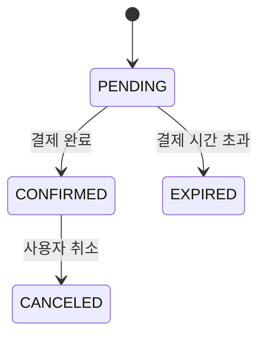

### 6.2 seat_hold.status

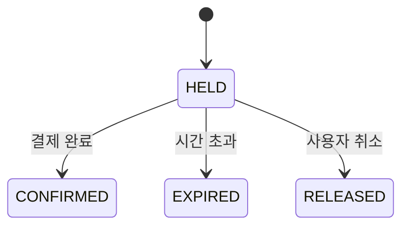

### 6.3 payment.status

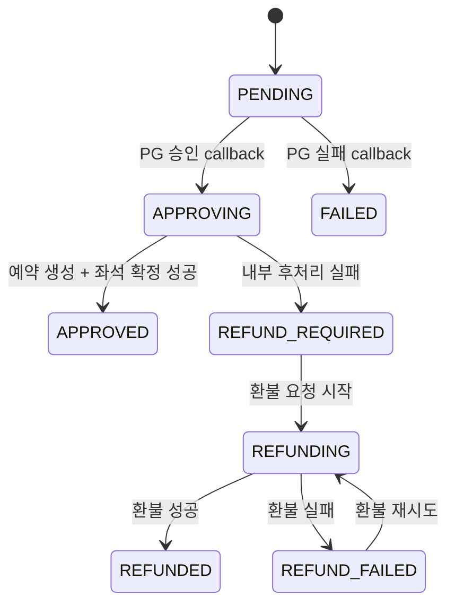

---

## 7. PostgreSQL 운영 고려사항

### 7.1 타임존

모든 시간 컬럼은 `TIMESTAMPTZ`로 통일해 UTC로 저장하고, 애플리케이션/조회 시점에 KST로 변환하는 정책을 권장합니다. DB 세션 타임존은 `SET TIME ZONE 'Asia/Seoul'`로 설정합니다.

### 7.2 VACUUM

`seat_hold`처럼 UPDATE/DELETE가 잦은 테이블은 dead tuple이 빠르게 쌓입니다. autovacuum 설정을 점검하고, 필요 시 테이블별 파라미터를 조정합니다.

```sql
ALTER TABLE seat_hold SET (
  autovacuum_vacuum_scale_factor = 0.05,
  autovacuum_analyze_scale_factor = 0.02
);
```

### 7.3 Connection Pool

PostgreSQL은 커넥션당 프로세스를 사용하므로 커넥션 수에 민감합니다. 애플리케이션 측 HikariCP 설정과 함께, 트래픽이 많다면 **PgBouncer** 도입을 검토합니다.

### 7.4 파티셔닝 (확장 시)

`seat_hold`, `reservation_event`는 시간이 지나면 빠르게 커지는 테이블입니다. PostgreSQL의 선언적 파티셔닝(Declarative Partitioning)으로 월별 RANGE 파티셔닝을 적용하면 운영이 수월해집니다.

```sql
CREATE TABLE seat_hold (
  ...
) PARTITION BY RANGE (created_at);

CREATE TABLE seat_hold_2026_04 PARTITION OF seat_hold
  FOR VALUES FROM ('2026-04-01') TO ('2026-05-01');
```

---

## 8. 향후 확장 고려사항

현재 구현 범위 밖이지만 운영 단계에서 추가 검토할 항목입니다.

- **payment provider 확장**: Kakao/Toss/Naver adapter 구현, provider별 callback 검증 강화
- **payment 운영 인증**: `POST /payments/:paymentId/refund`를 내부 운영자 권한 또는 시스템 간 인증으로 보호
- **message broker 기반 outbox 확장**: 결제/환불/알림/정산 consumer가 분리되는 시점에 Kafka/RabbitMQ/SQS 등으로 outbox publish 경로 확장
- **point / coupon**: 적립금·쿠폰 사용 내역
- **review**: 영화 리뷰 및 평점
- **읽기 전용 복제본(Read Replica)**: 영화/상영 일정 조회 트래픽이 많아질 경우 분리
- **PgBouncer**: 커넥션 풀링 미들웨어
- **시계열 데이터 아카이브**: 1년 이상 된 `seat_hold`, `reservation_event`, `payment_event_log`, `outbox_event` 콜드 스토리지 이관

---

## 9. 전체 테이블 요약

| 테이블 | 용도 |
|---|---|
| member | 회원 정보 |
| movie | 영화 정보 |
| movie_image | 영화 이미지 정보 |
| theater | 극장 정보 |
| screen | 상영관 정보 |
| seat | 상영관별 물리 좌석 |
| screening | 상영 일정 |
| seat_hold | 좌석 점유 이력 (Redis와 복합) |
| reservation | 예매 정보 |
| reservation_seat | 예매-좌석 매핑 |
| reservation_event | 예매 상태 변경 이력 |
| phone_verification | 휴대전화 인증 이력 |
| payment | 결제 요청, provider 거래 ID, 멱등성 키, 요청 해시, 현재 상태 |
| payment_event_log | 결제 상태 변경 감사 로그 |
| outbox_event | 결제 요청, 환불 요청, 예약 확정 등 비동기 후속 작업 |

**인프라:** PostgreSQL 15+ / Redis
