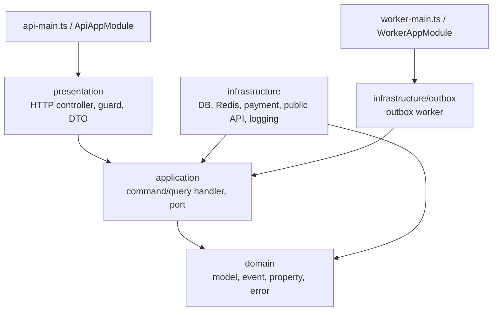

# Service 프로젝트 구조

NestJS 기반 백엔드 서비스의 디렉토리 구조와 계층 책임을 설명합니다. 이 문서는 `src`, `test`, `docs`, `scripts`처럼 직접 유지보수하는 경로를 기준으로 하며, `dist`, `coverage`, `node_modules` 같은 생성 산출물은 제외합니다.

## 개요

Service는 헥사고날 아키텍처를 따릅니다. HTTP 입구는 `presentation`, 유스케이스 조합은 `application`, 비즈니스 규칙은 `domain`, 외부 시스템 어댑터는 `infrastructure`가 담당합니다.

의존 방향은 `presentation -> application -> domain`, `infrastructure -> application -> domain`입니다. `domain`은 NestJS, MikroORM, persistence entity, framework exception에 의존하지 않습니다.

## 최상위 구조

| 경로 | 역할 |
|---|---|
| `src/api-main.ts` | API 프로세스 엔트리. HTTP 서버를 부팅합니다. |
| `src/api-app.module.ts` | API 프로세스 루트 모듈. config, logging, application, presentation을 조립합니다. |
| `src/worker-main.ts` | Worker 프로세스 엔트리. 백그라운드 작업을 부팅합니다. |
| `src/worker-app.module.ts` | Worker 프로세스 루트 모듈. config, logging, outbox worker를 조립합니다. |
| `src/domain` | 순수 도메인 모델과 도메인 규칙. |
| `src/application` | command/query 유스케이스, DTO, port 인터페이스. |
| `src/infrastructure` | DB, Redis, 결제, 외부 API, logging 등 port 구현체. |
| `src/presentation` | HTTP controller, request DTO, guard, interceptor, Swagger 설정. |
| `test` | domain, application, infrastructure, presentation, e2e 테스트. |
| `docs/openapi.json` | 현재 백엔드 OpenAPI 산출물. |
| `scripts` | OpenAPI 생성 등 service 전용 보조 스크립트. |

## `src/domain`

도메인의 중심 계층입니다. 프레임워크와 저장소 구현을 모르는 순수 TypeScript 코드만 둡니다.

| 경로 | 역할 |
|---|---|
| `domain/models` | `Member`, `Movie`, `Reservation`, `SeatHold`, `Payment`, `OutboxEvent` 등 핵심 모델. |
| `domain/property` | 상태와 값 집합. 예: `reservation-status`, `payment-status`, `seat-hold-status`. |
| `domain/events` | 도메인 이벤트. 현재 회원 로그 이벤트 등이 위치합니다. |
| `domain/errors` | 도메인 오류 코드와 오류 타입. |
| `domain/shared` | 도메인 공통 기반 타입. |

## `src/application`

유스케이스를 표현하고 외부 구현을 port로 추상화합니다. controller나 adapter가 직접 도메인을 조작하지 않고 command/query handler를 통해 흐름을 실행합니다.

| 경로 | 역할 |
|---|---|
| `application/commands` | 상태를 변경하는 command 흐름. 예: 회원가입, 로그인, 좌석 점유, 결제 요청, 예매 취소. |
| `application/commands/dto` | command 입력과 결과 DTO. |
| `application/commands/handlers` | command handler 구현. 트랜잭션과 도메인 모델 변경을 조합합니다. |
| `application/commands/ports` | command 흐름에 필요한 repository, cache, payment gateway, clock, token 등 port 인터페이스. |
| `application/query` | 조회 유스케이스. |
| `application/query/dto` | query 입력과 결과 DTO. |
| `application/query/handlers` | query handler 구현. |
| `application/query/ports` | 조회 repository와 외부 조회 port 인터페이스. |

## `src/infrastructure`

application port의 실제 구현체와 외부 시스템 연동을 둡니다.

| 경로 | 역할 |
|---|---|
| `infrastructure/persistence` | MikroORM entity, migration, repository, transaction manager. |
| `infrastructure/cache` | Redis access token 저장소, 좌석 점유 cache/lock. |
| `infrastructure/auth` | 인증 토큰 조회와 권한 확인 adapter. |
| `infrastructure/crypto` | 비밀번호 해시, opaque token, 난수 코드, 시계, 결제 요청 해시. |
| `infrastructure/payment` | local payment gateway와 callback 검증 adapter. |
| `infrastructure/outbox` | 결제/환불 후속 처리를 위한 outbox worker. |
| `infrastructure/public-api` | 주소 검색 adapter와 local 주소 데이터. |
| `infrastructure/config` | API/worker 실행 환경 변수 검증과 config provider. |
| `infrastructure/logging` | rvlog 기반 로그 이벤트 발행 adapter. |

## `src/presentation`

HTTP 진입점 계층입니다. request validation과 인증 guard를 처리하고, 실제 업무 처리는 command/query bus에 위임합니다.

| 경로 | 역할 |
|---|---|
| `presentation/http` | `member`, `movie`, `seat`, `payment`, `reservation`, `theater`, `health` controller. |
| `presentation/dto` | request DTO와 path/query/body validation. |
| `presentation/guard` | 회원 인증 guard. |
| `presentation/decorator` | 인증 사용자 추출 decorator. |
| `presentation/interceptor` | application/domain 오류를 HTTP 응답으로 변환. |
| `presentation/swagger` | Swagger/OpenAPI 설정. |

## 테스트 구조

| 경로 | 역할 |
|---|---|
| `test/domain` | 순수 도메인 규칙 테스트. |
| `test/application` | command/query handler와 DTO 테스트. |
| `test/infrastructure` | repository, cache, config, payment adapter 테스트. |
| `test/presentation` | controller, guard, interceptor 등 HTTP 경계 테스트. |
| `test/e2e` | 실제 API 흐름과 인프라 연동에 가까운 e2e 테스트. |

## 작업 규칙

- 새 비즈니스 규칙은 먼저 `domain`에 둘 수 있는지 확인합니다.
- 새 유스케이스는 `application/commands` 또는 `application/query`에 handler와 DTO를 추가합니다.
- 외부 시스템 연동은 application port를 먼저 정의하고 `infrastructure`에서 구현합니다.
- HTTP request/response 계약 변경은 `presentation/dto`, controller, `docs/openapi.json`을 함께 확인합니다.
- API 프로세스와 worker 프로세스가 동시에 필요한 기능은 `api-app.module.ts`와 `worker-app.module.ts`의 조립 범위를 분리해서 검토합니다.
