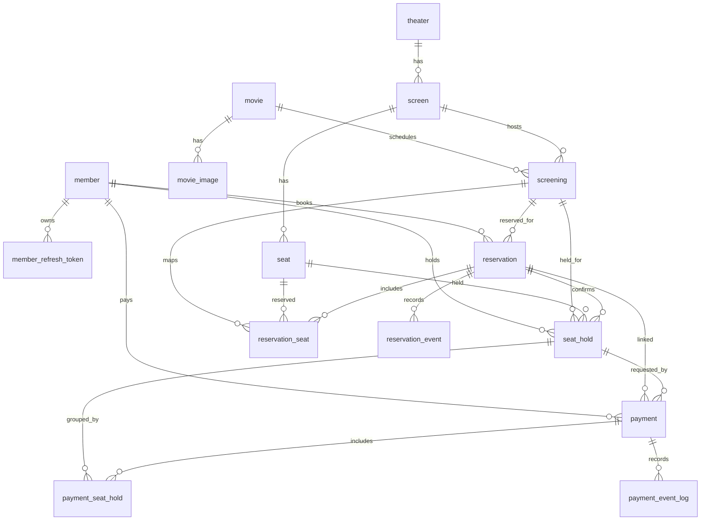
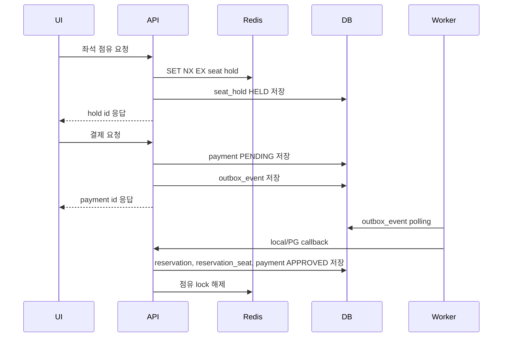

# Service 데이터베이스 구조

영화 예매 service의 PostgreSQL 데이터 모델과 운영 관점을 정리합니다. 이 문서는 현재 MikroORM migration과 entity를 기준으로 작성하며, 세부 컬럼의 최종 원천은 `src/infrastructure/persistence/migrations`와 `src/infrastructure/persistence/entities`입니다.

## 개요

Service DB는 회원/인증, 영화/상영, 좌석 점유/예매, 결제/이벤트, outbox 영역으로 나뉩니다. 좌석 점유의 실시간 동시성은 Redis가 담당하고, PostgreSQL은 이력과 최종 정합성 방어선을 담당합니다.



## 테이블 그룹

| 그룹 | 테이블 | 역할 |
|---|---|---|
| 회원/인증 | `member`, `member_refresh_token`, `phone_verification` | 회원 계정, refresh token, 휴대폰 인증 상태. |
| 영화/상영 | `movie`, `movie_image`, `theater`, `screen`, `seat`, `screening` | 영화와 극장, 상영관, 좌석, 상영 일정을 표현. |
| 좌석/예매 | `seat_hold`, `reservation`, `reservation_seat`, `reservation_event` | 좌석 임시 점유, 예매 확정, 예매 좌석, 예매 상태 이벤트. |
| 결제 | `payment`, `payment_seat_hold`, `payment_event_log` | 결제 요청/승인/환불 상태, 결제별 좌석 점유 매핑, 결제 이벤트 로그. |
| 비동기 처리 | `outbox_event` | 결제/환불 후속 작업을 위한 outbox 이벤트. |

## 회원/인증

### `member`

회원 계정의 기준 테이블입니다.

주요 제약:

- `uq_member_active_user_id`: 탈퇴하지 않은 회원의 로그인 ID 중복 방지.
- `uq_member_active_phone_number`: 탈퇴하지 않은 회원의 휴대폰 번호 중복 방지.

탈퇴 회원은 `status = 'WITHDRAWN'`으로 남겨 감사/예매 이력을 보존합니다. 따라서 `user_id`, `phone_number`는 전체 unique constraint가 아니라 `status <> 'WITHDRAWN'` 조건의 PostgreSQL partial unique index로 관리합니다.

주요 컬럼:

- `user_id`, `password_hash`, `name`, `birth_date`, `phone_number`, `address`
- `status`: 회원 상태.
- `failed_login_count`, `locked_at`: 로그인 실패와 잠금 관리.
- `created_at`, `updated_at`

### `member_refresh_token`

회원별 refresh token을 저장합니다.

주요 제약:

- `uq_member_refresh_token_token`: refresh token 자체의 중복 방지.
- `member_id -> member.id`

### `phone_verification`

휴대폰 인증번호 발급과 검증 상태를 저장합니다.

주요 인덱스:

- `idx_phone_verification_phone_status`: 휴대폰 번호와 인증 상태 기준 조회.

## 영화/상영

### `movie`, `movie_image`

영화 기본 정보와 이미지 정보를 분리합니다.

주요 인덱스:

- `idx_movie_image_movie_type_order`: 영화별 이미지 타입과 정렬 순서 조회.

### `theater`, `screen`, `seat`, `screening`

극장, 상영관, 물리 좌석, 상영 일정을 구성합니다.

주요 제약:

- `uq_theater_name`: 극장명 중복 방지.
- `uq_seat_screen_row_col`: 같은 상영관 내 좌석 행/열 중복 방지.
- `screen.theater_id -> theater.id`
- `seat.screen_id -> screen.id`
- `screening.movie_id -> movie.id`
- `screening.screen_id -> screen.id`

## 좌석 점유/예매

### `seat_hold`

좌석 임시 점유 이력을 저장합니다. Redis는 실시간 lock과 TTL을 담당하고, DB는 누가 언제 어떤 좌석을 점유했는지 기록합니다.

주요 컬럼:

- `screening_id`, `seat_id`, `member_id`
- `reservation_id`: 예매 확정 시 연결.
- `status`: `HELD`, `CONFIRMED`, `EXPIRED`, `RELEASED` 계열 상태.
- `expires_at`: 점유 만료 예정 시각.

주요 인덱스:

- `idx_hold_member_status`: 회원별 진행 중인 점유 조회.
- `idx_hold_screening_active`: 상영별 점유 조회.
- `idx_hold_expires_active`: 만료 처리 대상 조회.

주의:

- `seat_hold`는 이력 테이블이므로 `screening_id + seat_id` unique 제약을 두지 않습니다.
- 같은 좌석의 여러 점유 시도는 시간 순서대로 누적될 수 있습니다.

### `reservation`

예매 단위의 기준 테이블입니다.

주요 제약과 인덱스:

- `uq_reservation_number`: 예매번호 중복 방지.
- `idx_reservation_member_created`: 회원별 예매 목록 최신순 조회.
- `idx_reservation_member_status`: 회원별 상태 탭 조회.

### `reservation_seat`

예매와 좌석의 매핑 테이블입니다.

핵심 제약:

- `uq_reservation_seat_screening_seat`: 같은 상영의 같은 좌석이 중복 예매되는 것을 DB 레벨에서 차단합니다.

이 제약은 Redis lock, application transaction, payment callback 흐름이 모두 실패하더라도 중복 예매를 막는 최후의 방어선입니다.

### `reservation_event`

예매 상태 변경 이력을 저장합니다.

주요 인덱스:

- `idx_reservation_event`: 예매별 이벤트 시간순 조회.

## 결제

### `payment`

결제 요청과 상태를 저장합니다. 현재 local payment gateway와 callback 검증 흐름을 포함하며, 실제 PG adapter를 추가할 때도 이 테이블을 기준으로 상태를 관리합니다.

주요 컬럼:

- `member_id`, `seat_hold_id`, `reservation_id`
- `idempotency_key`: 동일 사용자의 중복 결제 요청 방지.
- `request_hash`: 같은 idempotency key로 다른 요청 본문이 들어오는지 검증.
- `provider`, `provider_payment_id`
- `amount`, `status`
- `requested_at`, `approved_at`, `failed_at`, `refunded_at`
- `failure_reason`

주요 제약과 인덱스:

- `uq_payment_member_idempotency_key`: 회원별 idempotency key 중복 방지.
- `uq_payment_provider_payment_id`: PG provider 결제 ID 중복 방지.
- `idx_payment_member_created`: 회원별 결제 이력 조회.
- `idx_payment_seat_hold`: 좌석 점유 기준 결제 조회.

`payment.seat_hold_id`는 기존 단일 좌석 결제 호환과 대표 점유 참조로 유지합니다. 여러 좌석을 한 번에 결제하는 경우 실제 결제-점유 관계는 `payment_seat_hold`에서 관리합니다.

### `payment_seat_hold`

결제 1건과 좌석 점유 여러 건을 연결하는 매핑 테이블입니다.

주요 제약과 인덱스:

- `uq_payment_seat_hold_payment_hold`: 같은 결제 안에서 같은 점유가 중복 연결되는 것을 방지합니다.
- `idx_payment_seat_hold_payment`: 결제 기준 점유 목록 조회.
- `idx_payment_seat_hold_seat_hold`: 점유 기준 결제 역조회.

### `payment_event_log`

결제 상태 변경 이벤트를 저장합니다.

주요 컬럼:

- `payment_id`
- `event_type`
- `previous_status`, `next_status`
- `provider`, `provider_payment_id`
- `amount`, `reason`, `metadata`
- `occurred_at`, `created_at`

주요 인덱스:

- `idx_payment_event_log_payment_created`: 결제별 이벤트 시간순 조회.

## Outbox

### `outbox_event`

트랜잭션 안에서 발생한 후속 처리 이벤트를 저장하고, worker가 polling해서 처리합니다. 현재 결제/환불 후속 작업에 사용합니다.

주요 컬럼:

- `aggregate_type`, `aggregate_id`
- `event_type`
- `payload`
- `status`, `retry_count`, `next_retry_at`, `locked_until`
- `last_error`
- `occurred_at`, `published_at`, `created_at`, `updated_at`

주요 인덱스:

- `idx_outbox_publishable`: worker가 처리 가능한 이벤트를 찾는 조회.
- `idx_outbox_aggregate`: aggregate별 이벤트 조회.

## 좌석 예매 정합성 흐름



정합성 기준:

- 좌석 클릭 순간 동시성은 Redis lock으로 빠르게 차단합니다.
- 점유 이력은 `seat_hold`에 남깁니다.
- 예매 확정의 최종 중복 방어선은 `reservation_seat(screening_id, seat_id)` unique 제약입니다.
- 결제 요청 중복 방어선은 `payment(member_id, idempotency_key)` unique 제약입니다.
- PG 결제 ID 중복 방어선은 `payment(provider, provider_payment_id)` unique 제약입니다.
- 결제-좌석 점유 매핑 중복 방어선은 `payment_seat_hold(payment_id, seat_hold_id)` unique 제약입니다.
- 회원 ID/휴대폰 재사용 정책은 `member(user_id)`, `member(phone_number)`의 active-only partial unique index로 보장합니다.

## Migration과 seed

| 파일 | 역할 |
|---|---|
| `Migration202604300001CreateTables.ts` | 핵심 테이블, FK, unique 제약, 인덱스, 상영 시간 중복 방지 트리거 생성. |
| `Migration202604300002SeedData.ts` | 로컬 개발용 영화관, 상영관, 좌석, 영화, 이미지, 상영 일정 seed. |

운영 데이터와 임시 seed 데이터의 생명주기는 분리해야 합니다. 임시 seed는 개발/검증 편의를 위한 데이터로 보고, 운영 seed가 필요해지면 별도 migration 정책을 둡니다.

## 운영 고려사항

- 모든 시간 컬럼은 `timestamptz`를 기본으로 사용합니다.
- `seat_hold`, `outbox_event`, `payment_event_log`, `reservation_event`는 시간이 지날수록 빠르게 증가할 수 있으므로 보관 기간과 아카이브 정책이 필요합니다.
- `seat_hold`는 update가 잦으므로 autovacuum과 인덱스 bloat를 주기적으로 관찰합니다.
- outbox worker는 `status`, `next_retry_at`, `locked_until` 기준으로 재시도와 중복 처리를 제어해야 합니다.
- 실제 PG 연동 시 callback/webhook 검증 결과만 `payment.status`와 `reservation` 확정에 반영해야 하며, UI 신호만으로 결제를 확정하지 않습니다.

---

## 상세 테이블 설계

> PostgreSQL 컨벤션에 맞춰 `BIGSERIAL`(또는 `GENERATED ALWAYS AS IDENTITY`), `TIMESTAMPTZ`, `JSONB` 등을 사용합니다. 시간 컬럼은 타임존을 포함한 `TIMESTAMPTZ`로 통일합니다.

### 3.1 member (회원)

| 컬럼 | 타입 | 제약 | 설명 |
|---|---|---|---|
| id | BIGSERIAL | PK | 회원 ID |
| user_id | VARCHAR(30) | NOT NULL | 로그인 ID |
| password_hash | VARCHAR(255) | NOT NULL | 암호화된 비밀번호 |
| name | VARCHAR(50) | NOT NULL | 이름 |
| birth_date | DATE | NOT NULL | 생년월일 |
| phone_number | VARCHAR(255) | NOT NULL | 휴대폰 번호. 암호화 저장 대상 |
| address | VARCHAR(255) | NOT NULL | 주소 |
| status | VARCHAR(20) | NOT NULL | ACTIVE, LOCKED, WITHDRAWN 등 |
| failed_login_count | INT | NOT NULL DEFAULT 0 | 로그인 실패 횟수 |
| locked_at | TIMESTAMPTZ | | 잠금 일시 |
| created_at | TIMESTAMPTZ | NOT NULL DEFAULT now() | 가입일시 |
| updated_at | TIMESTAMPTZ | NOT NULL DEFAULT now() | 수정일시 |

**Unique 구조:**

```sql
CREATE UNIQUE INDEX uq_member_active_user_id
  ON member (user_id)
  WHERE status <> 'WITHDRAWN';

CREATE UNIQUE INDEX uq_member_active_phone_number
  ON member (phone_number)
  WHERE status <> 'WITHDRAWN';
```

탈퇴 회원은 이력 보존을 위해 row를 유지하므로, 전체 row 기준 unique constraint는 사용하지 않습니다. 활성 회원끼리만 `user_id`, `phone_number`가 중복되지 않게 제한하고, 탈퇴한 회원의 로그인 ID/휴대폰 번호는 재사용할 수 있습니다.

### 3.2 movie (영화)

| 컬럼 | 타입 | 제약 | 설명 |
|---|---|---|---|
| id | BIGSERIAL | PK | 영화 ID |
| title | VARCHAR(200) | NOT NULL | 제목 |
| director | VARCHAR(100) | | 감독 |
| genre | VARCHAR(50) | | 장르 |
| running_time | INT | NOT NULL | 상영시간(분) |
| rating | VARCHAR(20) | | 관람등급 (ALL, 12, 15, 19) |
| release_date | DATE | | 개봉일 |
| poster_url | VARCHAR(500) | | 포스터 이미지 URL |
| description | TEXT | | 줄거리 |
| created_at | TIMESTAMPTZ | NOT NULL DEFAULT now() | 등록일시 |

### 3.3 movie_image (영화 이미지)

| 컬럼 | 타입 | 제약 | 설명 |
|---|---|---|---|
| id | BIGSERIAL | PK | 영화 이미지 ID |
| movie_id | BIGINT | FK → movie.id, NOT NULL | 영화 ID |
| image_type | VARCHAR(20) | NOT NULL | POSTER, STILL |
| url | VARCHAR(500) | NOT NULL | 이미지 URL |
| sort_order | INT | NOT NULL DEFAULT 0 | 노출 순서 |
| created_at | TIMESTAMPTZ | NOT NULL DEFAULT now() | 등록일시 |

**인덱스:**

```sql
CREATE INDEX idx_movie_image_movie_type_order
  ON movie_image (movie_id, image_type, sort_order);
```

`movie.poster_url`은 기존 목록 API 호환용 대표 포스터 필드입니다. 신규 이미지 확장은 `movie_image`를 기준으로 저장하며, 목록 조회에서는 `movie_image`의 `POSTER`를 우선 사용합니다.

### 3.4 theater (극장)

| 컬럼 | 타입 | 제약 | 설명 |
|---|---|---|---|
| id | BIGSERIAL | PK | 극장 ID |
| name | VARCHAR(100) | UNIQUE, NOT NULL | 극장명 |
| address | VARCHAR(255) | NOT NULL | 극장 주소 |
| latitude | DOUBLE PRECISION | | 위도 |
| longitude | DOUBLE PRECISION | | 경도 |
| created_at | TIMESTAMPTZ | NOT NULL DEFAULT now() | 등록일시 |

### 3.5 screen (상영관)

| 컬럼 | 타입 | 제약 | 설명 |
|---|---|---|---|
| id | BIGSERIAL | PK | 상영관 ID |
| theater_id | BIGINT | FK → theater.id, NOT NULL | 극장 ID |
| name | VARCHAR(50) | NOT NULL | 상영관명 (1관, IMAX 등) |
| total_seats | INT | NOT NULL | 총 좌석 수 |

### 3.6 seat (좌석)

| 컬럼 | 타입 | 제약 | 설명 |
|---|---|---|---|
| id | BIGSERIAL | PK | 좌석 ID |
| screen_id | BIGINT | FK → screen.id | 상영관 ID |
| seat_row | VARCHAR(5) | NOT NULL | 행 (A, B, C...) |
| seat_col | INT | NOT NULL | 열 (1, 2, 3...) |
| seat_type | VARCHAR(20) | | NORMAL, COUPLE, DISABLED |

**제약:** `UNIQUE (screen_id, seat_row, seat_col)`

### 3.7 screening (상영 일정)

| 컬럼 | 타입 | 제약 | 설명 |
|---|---|---|---|
| id | BIGSERIAL | PK | 상영 ID |
| movie_id | BIGINT | FK → movie.id | 영화 ID |
| screen_id | BIGINT | FK → screen.id | 상영관 ID |
| start_at | TIMESTAMPTZ | NOT NULL | 시작 시각 |
| end_at | TIMESTAMPTZ | NOT NULL | 종료 시각 |
| price | INT | NOT NULL | 기본 가격 |

### 3.8 reservation (예매)

| 컬럼 | 타입 | 제약 | 설명 |
|---|---|---|---|
| id | BIGSERIAL | PK | 예매 ID |
| reservation_number | VARCHAR(20) | UNIQUE, NOT NULL | 예매번호 (예: R20260428001) |
| member_id | BIGINT | FK → member.id | 회원 ID |
| screening_id | BIGINT | FK → screening.id | 상영 ID |
| status | VARCHAR(20) | NOT NULL | PENDING, CONFIRMED, CANCELED, EXPIRED |
| total_price | INT | NOT NULL | 총 결제 금액 |
| canceled_at | TIMESTAMPTZ | NULL | 취소 일시 |
| cancel_reason | VARCHAR(100) | NULL | 취소 사유 |
| created_at | TIMESTAMPTZ | NOT NULL DEFAULT now() | 예매일시 |

**인덱스:**

```sql
CREATE INDEX idx_reservation_member_created
  ON reservation (member_id, created_at DESC);

CREATE INDEX idx_reservation_member_status
  ON reservation (member_id, status, created_at DESC);
```

### 3.9 reservation_seat (예매-좌석 매핑)

| 컬럼 | 타입 | 제약 | 설명 |
|---|---|---|---|
| id | BIGSERIAL | PK | |
| reservation_id | BIGINT | FK → reservation.id | 예매 ID |
| screening_id | BIGINT | FK → screening.id | 상영 ID |
| seat_id | BIGINT | FK → seat.id | 좌석 ID |

**핵심 제약:** `UNIQUE (screening_id, seat_id)` — 같은 상영의 같은 좌석 중복 예매 방지 (DB 레벨 최후 방어선)

### 3.10 seat_hold (좌석 점유 이력)

| 컬럼 | 타입 | 제약 | 설명 |
|---|---|---|---|
| id | BIGSERIAL | PK | |
| screening_id | BIGINT | FK, NOT NULL | 상영 ID |
| seat_id | BIGINT | FK, NOT NULL | 좌석 ID |
| member_id | BIGINT | FK, NOT NULL | 점유한 회원 |
| reservation_id | BIGINT | FK, NULL | 예매 확정 시 연결 |
| status | VARCHAR(20) | NOT NULL | HELD, CONFIRMED, EXPIRED, RELEASED |
| expires_at | TIMESTAMPTZ | NOT NULL | 만료 예정 시각 |
| created_at | TIMESTAMPTZ | NOT NULL DEFAULT now() | 점유 시작 |
| updated_at | TIMESTAMPTZ | NOT NULL DEFAULT now() | |

**중요:** 이력 테이블이므로 `UNIQUE (screening_id, seat_id)` 제약을 걸지 않습니다. 같은 좌석에 대한 여러 점유 시도가 시간차로 누적되는 게 정상입니다 (HELD → EXPIRED → 다른 회원 HELD → CONFIRMED).

**인덱스 (PostgreSQL 부분 인덱스 활용):**

PostgreSQL은 부분 인덱스(Partial Index)를 지원하므로 `HELD` 상태만 인덱싱해 효율을 높일 수 있습니다.

```sql
-- 회원의 진행 중인 점유 조회
CREATE INDEX idx_hold_member_status
  ON seat_hold (member_id, status, created_at DESC);

-- 활성 점유만 인덱싱 (대부분의 조회는 HELD 상태)
CREATE INDEX idx_hold_screening_active
  ON seat_hold (screening_id)
  WHERE status = 'HELD';

-- 만료 처리 스케줄러용 (HELD 만료 대상만)
CREATE INDEX idx_hold_expires_active
  ON seat_hold (expires_at)
  WHERE status = 'HELD';
```

### 3.11 reservation_event (예매 이벤트 기록)

| 컬럼 | 타입 | 제약 | 설명 |
|---|---|---|---|
| id | BIGSERIAL | PK | |
| reservation_id | BIGINT | FK → reservation.id, NOT NULL | 예매 ID |
| event_type | VARCHAR(30) | NOT NULL | CREATED, CONFIRMED, CANCELED, EXPIRED |
| description | VARCHAR(255) | | 부가 설명 (취소 사유 등) |
| created_at | TIMESTAMPTZ | NOT NULL DEFAULT now() | 발생 시각 |

**인덱스:**

```sql
CREATE INDEX idx_reservation_event
  ON reservation_event (reservation_id, created_at);
```

**event_type 값:**

- `CREATED` — 예매 생성
- `CONFIRMED` — 결제 완료/확정
- `CANCELED` — 사용자 취소
- `EXPIRED` — 만료 처리

### 3.12 phone_verification (휴대전화 인증)

| 컬럼 | 타입 | 제약 | 설명 |
|---|---|---|---|
| id | BIGSERIAL | PK | 인증 요청 ID |
| phone_number | VARCHAR(255) | NOT NULL | 휴대전화번호. 암호화 저장 대상 |
| code | VARCHAR(6) | NOT NULL | 인증 코드 |
| status | VARCHAR(20) | NOT NULL | PENDING, VERIFIED, EXPIRED |
| expires_at | TIMESTAMPTZ | NOT NULL | 만료 일시 |
| verified_at | TIMESTAMPTZ | | 인증 완료 일시 |
| created_at | TIMESTAMPTZ | NOT NULL DEFAULT now() | 생성 일시 |
| updated_at | TIMESTAMPTZ | NOT NULL DEFAULT now() | 수정 일시 |

**인덱스:**

```sql
CREATE INDEX idx_phone_verification_phone_status
  ON phone_verification (phone_number, status);
```

### 3.13 payment (결제)

| 컬럼 | 타입 | 제약 | 설명 |
|---|---|---|---|
| id | BIGSERIAL | PK | 결제 ID |
| member_id | BIGINT | FK → member.id, NOT NULL | 결제 요청 회원 |
| seat_hold_id | BIGINT | FK → seat_hold.id, NOT NULL | 결제 기준 좌석 점유 |
| idempotency_key | VARCHAR(100) | NOT NULL | 결제 요청 멱등성 키 |
| request_hash | VARCHAR(64) | NOT NULL | 동일 멱등성 키의 요청 본문 비교용 SHA-256 해시 |
| reservation_id | BIGINT | FK → reservation.id | 결제 승인 후 생성된 예매 |
| provider | VARCHAR(20) | NOT NULL | LOCAL, KAKAO, TOSS, NAVER 등 |
| provider_payment_id | VARCHAR(100) | | PG사 결제 ID |
| amount | INT | NOT NULL | 결제 금액 |
| status | VARCHAR(30) | NOT NULL | PENDING, APPROVING, APPROVED, FAILED, REFUND_REQUIRED, REFUNDING, REFUNDED, REFUND_FAILED |
| requested_at | TIMESTAMPTZ | NOT NULL | 결제 요청 시각 |
| approved_at | TIMESTAMPTZ | | 승인 완료 시각 |
| failed_at | TIMESTAMPTZ | | 실패 시각 |
| refunded_at | TIMESTAMPTZ | | 환불 완료 시각 |
| failure_reason | VARCHAR(255) | | 실패 또는 환불 필요 사유 |
| created_at | TIMESTAMPTZ | NOT NULL DEFAULT now() | 생성 시각 |
| updated_at | TIMESTAMPTZ | NOT NULL DEFAULT now() | 수정 시각 |

**인덱스 / 제약:**

```sql
CREATE INDEX idx_payment_member_created
  ON payment (member_id, created_at DESC);

CREATE INDEX idx_payment_seat_hold
  ON payment (seat_hold_id);

ALTER TABLE payment
  ADD CONSTRAINT uq_payment_member_idempotency_key
  UNIQUE (member_id, idempotency_key);

ALTER TABLE payment
  ADD CONSTRAINT uq_payment_provider_payment_id
  UNIQUE (provider, provider_payment_id);
```

`payment.seat_hold_id`는 대표 점유를 가리키는 legacy 호환 컬럼입니다. 결제 1건에 좌석 여러 개가 포함되는 현재 흐름에서는 `payment_seat_hold`가 결제와 점유 목록의 기준 매핑입니다.

### 3.14 payment_seat_hold (결제-좌석 점유 매핑)

| 컬럼 | 타입 | 제약 | 설명 |
|---|---|---|---|
| id | BIGSERIAL | PK | 결제-점유 매핑 ID |
| payment_id | BIGINT | FK → payment.id, NOT NULL | 결제 ID |
| seat_hold_id | BIGINT | FK → seat_hold.id, NOT NULL | 좌석 점유 ID |

**인덱스 / 제약:**

```sql
CREATE INDEX idx_payment_seat_hold_payment
  ON payment_seat_hold (payment_id);

CREATE INDEX idx_payment_seat_hold_seat_hold
  ON payment_seat_hold (seat_hold_id);

ALTER TABLE payment_seat_hold
  ADD CONSTRAINT uq_payment_seat_hold_payment_hold
  UNIQUE (payment_id, seat_hold_id);
```

이 unique 제약은 같은 결제에 같은 좌석 점유가 중복 연결되는 것을 막습니다. 결제 1건이 여러 좌석 점유를 포함할 수 있으므로, `payment_id` 단독 unique 제약은 두지 않습니다.

### 3.15 payment_event_log (결제 이벤트 로그)

| 컬럼 | 타입 | 제약 | 설명 |
|---|---|---|---|
| id | BIGSERIAL | PK | 결제 이벤트 로그 ID |
| payment_id | BIGINT | FK → payment.id, NOT NULL | 결제 ID |
| event_type | VARCHAR(50) | NOT NULL | PAYMENT_REQUESTED, PAYMENT_APPROVED 등 |
| previous_status | VARCHAR(30) | | 이전 결제 상태 |
| next_status | VARCHAR(30) | NOT NULL | 변경 후 결제 상태 |
| provider | VARCHAR(20) | NOT NULL | 결제 provider |
| provider_payment_id | VARCHAR(100) | | PG사 결제 ID |
| amount | INT | NOT NULL | 결제 금액 |
| reason | VARCHAR(255) | | 상태 변경 사유 |
| metadata | JSONB | | 추가 감사 정보 |
| occurred_at | TIMESTAMPTZ | NOT NULL | 이벤트 발생 시각 |
| created_at | TIMESTAMPTZ | NOT NULL DEFAULT now() | 저장 시각 |

```sql
CREATE INDEX idx_payment_event_log_payment_created
  ON payment_event_log (payment_id, created_at);
```

### 3.16 outbox_event (아웃박스 이벤트)

| 컬럼 | 타입 | 제약 | 설명 |
|---|---|---|---|
| id | BIGSERIAL | PK | 아웃박스 이벤트 ID |
| aggregate_type | VARCHAR(50) | NOT NULL | PAYMENT, RESERVATION 등 |
| aggregate_id | VARCHAR(50) | NOT NULL | aggregate 식별자 |
| event_type | VARCHAR(80) | NOT NULL | PAYMENT_REQUESTED, PAYMENT_REFUND_REQUESTED 등 |
| payload | JSONB | NOT NULL | worker 처리 payload |
| status | VARCHAR(20) | NOT NULL | PENDING, PROCESSING, PUBLISHED, FAILED |
| retry_count | INT | NOT NULL | 재시도 횟수 |
| next_retry_at | TIMESTAMPTZ | | 다음 재시도 가능 시각 |
| locked_until | TIMESTAMPTZ | | worker 처리 잠금 만료 시각 |
| last_error | VARCHAR(500) | | 마지막 실패 사유 |
| occurred_at | TIMESTAMPTZ | NOT NULL | 이벤트 발생 시각 |
| published_at | TIMESTAMPTZ | | 발행 완료 시각 |
| created_at | TIMESTAMPTZ | NOT NULL DEFAULT now() | 생성 시각 |
| updated_at | TIMESTAMPTZ | NOT NULL DEFAULT now() | 수정 시각 |

```sql
CREATE INDEX idx_outbox_publishable
  ON outbox_event (status, next_retry_at, occurred_at);

CREATE INDEX idx_outbox_aggregate
  ON outbox_event (aggregate_type, aggregate_id);
```

> **선택 사항:** `event_type`은 `VARCHAR` 대신 PostgreSQL의 `ENUM` 타입으로 정의할 수도 있습니다. 다만 ENUM은 값 추가 시 `ALTER TYPE`이 필요해 운영 유연성이 떨어지므로, `VARCHAR + CHECK 제약` 또는 단순 `VARCHAR`를 권장합니다.

```sql
-- CHECK 제약으로 값 범위 보장 (선택)
ALTER TABLE reservation_event
  ADD CONSTRAINT chk_event_type
  CHECK (event_type IN ('CREATED', 'CONFIRMED', 'CANCELED', 'EXPIRED'));
```

---

## 주요 조회 SQL

### 5.1 내 예매 내역 조회

PostgreSQL의 `string_agg` 함수를 사용합니다 (MySQL의 `GROUP_CONCAT`과 동일한 역할).

```sql
SELECT
    r.reservation_number,
    r.status,
    r.total_price,
    r.created_at,
    m.title              AS movie_title,
    m.poster_url,
    s.start_at,
    sc.name              AS screen_name,
    string_agg(
        seat.seat_row || seat.seat_col::text,
        ', ' ORDER BY seat.seat_row, seat.seat_col
    ) AS seats
FROM reservation r
JOIN screening s         ON s.id = r.screening_id
JOIN movie m             ON m.id = s.movie_id
JOIN screen sc           ON sc.id = s.screen_id
JOIN reservation_seat rs ON rs.reservation_id = r.id
JOIN seat                ON seat.id = rs.seat_id
WHERE r.member_id = $1
GROUP BY r.id, m.id, s.id, sc.id
ORDER BY r.created_at DESC
LIMIT 20 OFFSET 0;
```

> PostgreSQL은 `GROUP BY`에서 SELECT의 모든 비집계 컬럼을 명시해야 하지만, PK가 포함되면 같은 테이블의 다른 컬럼은 자동으로 함수적 종속(functional dependency)이 인정되어 SELECT에서 사용 가능합니다.

### 5.2 예매 내역 화면 분기

| 탭 | 조건 |
|---|---|
| 관람 예정 | `status = 'CONFIRMED' AND s.start_at > now()` |
| 관람 완료 | `status = 'CONFIRMED' AND s.start_at <= now()` |
| 취소 | `status = 'CANCELED'` |

### 5.3 예매 이력 조회

```sql
SELECT event_type, description, created_at
FROM reservation_event
WHERE reservation_id = $1
ORDER BY created_at ASC;
```

---

## PostgreSQL 운영 상세

### 7.1 타임존

모든 시간 컬럼은 `TIMESTAMPTZ`로 통일해 UTC로 저장하고, 애플리케이션/조회 시점에 KST로 변환하는 정책을 권장합니다. DB 세션 타임존은 `SET TIME ZONE 'Asia/Seoul'`로 설정합니다.

### 7.2 VACUUM

`seat_hold`처럼 UPDATE/DELETE가 잦은 테이블은 dead tuple이 빠르게 쌓입니다. autovacuum 설정을 점검하고, 필요 시 테이블별 파라미터를 조정합니다.

```sql
ALTER TABLE seat_hold SET (
  autovacuum_vacuum_scale_factor = 0.05,
  autovacuum_analyze_scale_factor = 0.02
);
```

### 7.3 Connection Pool

PostgreSQL은 커넥션당 프로세스를 사용하므로 커넥션 수에 민감합니다. 애플리케이션 측 HikariCP 설정과 함께, 트래픽이 많다면 **PgBouncer** 도입을 검토합니다.

### 7.4 파티셔닝 (확장 시)

`seat_hold`, `reservation_event`는 시간이 지나면 빠르게 커지는 테이블입니다. PostgreSQL의 선언적 파티셔닝(Declarative Partitioning)으로 월별 RANGE 파티셔닝을 적용하면 운영이 수월해집니다.

```sql
CREATE TABLE seat_hold (
  ...
) PARTITION BY RANGE (created_at);

CREATE TABLE seat_hold_2026_04 PARTITION OF seat_hold
  FOR VALUES FROM ('2026-04-01') TO ('2026-05-01');
```

---

## 전체 테이블 요약

| 테이블 | 용도 |
|---|---|
| member | 회원 정보 |
| movie | 영화 정보 |
| movie_image | 영화 이미지 정보 |
| theater | 극장 정보 |
| screen | 상영관 정보 |
| seat | 상영관별 물리 좌석 |
| screening | 상영 일정 |
| seat_hold | 좌석 점유 이력 (Redis와 복합) |
| reservation | 예매 정보 |
| reservation_seat | 예매-좌석 매핑 |
| reservation_event | 예매 상태 변경 이력 |
| phone_verification | 휴대전화 인증 이력 |
| payment | 결제 요청, provider 거래 ID, 멱등성 키, 요청 해시, 현재 상태 |
| payment_seat_hold | 결제 1건에 포함된 좌석 점유 목록 |
| payment_event_log | 결제 상태 변경 감사 로그 |
| outbox_event | 결제 요청, 환불 요청, 예약 확정 등 비동기 후속 작업 |

**인프라:** PostgreSQL 15+ / Redis
