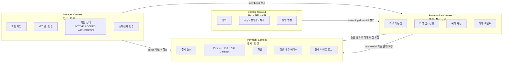
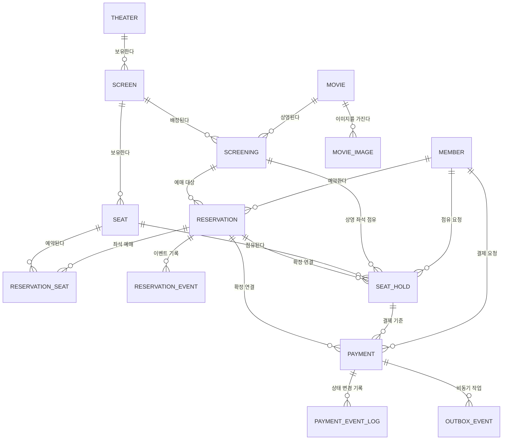

# 영화 예매 서비스 시스템 설계 문서

## 1. 개요

영화 예매 서비스의 핵심 도메인 설계 문서입니다. 바운디드 컨텍스트, 핵심 도메인, 컨텍스트 간 관계, 상태 소유권을 정의합니다. 단계별 업무 흐름은 [PROCCESS.md](PROCCESS.md), 테이블과 저장소 상세는 [DATABASE.md](DATABASE.md)에서 관리합니다.

### 1.1 핵심 도메인

- 회원 (Member)
- 영화 (Movie)
- 영화 이미지 (Movie Image)
- 극장 (Theater)
- 상영관 / 좌석 (Screen / Seat)
- 상영 일정 (Screening)
- 예매 (Reservation)
- 좌석 점유 (Seat Hold) — Redis + DB 복합
- 예매 이벤트 기록 (Reservation Event)
- 결제 (Payment)
- 결제 이벤트 로그 (Payment Event Log)
- 아웃박스 이벤트 (Outbox Event)

### 1.2 기술 스택

- RDB: **PostgreSQL 15+**
- Cache / Lock: Redis
- 애플리케이션: NestJS

### 1.3 바운디드 컨텍스트

영화 예매 서비스는 기능 단위가 아니라 도메인 언어와 책임 경계를 기준으로 바운디드 컨텍스트를 나눕니다. 특히 `member`와 `payment`는 다른 도메인에서 참조는 가능하지만 내부 정책을 공유하지 않는 독립 컨텍스트로 관리해야 합니다.

| 컨텍스트 | 책임 | 소유 데이터 | 외부에 노출하는 식별자/계약 |
|---|---|---|---|
| Member Context | 인증, 회원 가입, 회원 상태, 휴대전화 인증 | `member`, `phone_verification` | `memberId`, 인증 토큰, 회원 상태 |
| Catalog Context | 영화, 이미지, 극장, 상영관, 물리 좌석, 상영 일정 조회 | `movie`, `movie_image`, `theater`, `screen`, `seat`, `screening` | `movieId`, `screeningId`, `seatId` |
| Reservation Context | 좌석 가용성, 좌석 임시점유, 예매 확정/취소, 예매 이력 | `seat_hold`, `reservation`, `reservation_seat`, `reservation_event` | `seatHoldId`, `reservationId`, `reservationNumber` |
| Payment Context | 결제 요청, PG callback 처리, 환불, 결제 감사 로그, 정산 기준 데이터 | `payment`, `payment_event_log`, 결제/환불 outbox | `paymentId`, `providerPaymentId`, 결제 상태, 정산 이벤트 |

**Member Context 분리 원칙**

- 회원 인증/회원 도메인은 `member` 컨텍스트에서만 회원 상태 전이, 비밀번호 검증, 로그인 실패 잠금, 휴대전화 인증 정책을 소유합니다.
- 예매와 결제 컨텍스트는 회원 상세 정보나 인증 정책을 직접 변경하지 않고, 인증된 요청의 `memberId`와 필요한 최소 상태만 참조합니다.
- 회원 탈퇴, 잠금, 휴면 같은 정책 변경은 Member Context의 도메인 이벤트 또는 조회 계약을 통해 다른 컨텍스트에 전달합니다.

**Opaque Token 선택 이유**

- 현재 인증 토큰은 JWT가 아니라 Opaque token을 사용합니다. Access token은 Redis에 저장하고, Refresh token은 DB에 저장합니다.
- 토큰 생성은 단일 `OpaqueTokenGenerator`로 통일하고, 저장은 `TokenRepository`가 `TokenType.ACCESS`는 Redis repository, `TokenType.REFRESH`는 DB repository로 분기합니다. TTL은 `ACCESS_TOKEN_TTL_SECONDS`, `REFRESH_TOKEN_TTL_SECONDS` 환경변수에서 주입받습니다.
- Opaque token은 서버 저장소에서 토큰 상태를 조회하므로 로그아웃, 회원탈퇴, 관리자 강제 만료 같은 이벤트가 발생하면 즉시 세션을 만료할 수 있습니다. JWT는 자체 서명 토큰 특성상 만료 시간 전까지 이미 발급된 토큰을 즉시 무효화하려면 별도의 denylist나 세션 저장소가 필요합니다.
- 현재 서비스는 분산된 마이크로서비스 구조가 아니며, 단일 service가 인증과 업무 API를 함께 처리합니다. 따라서 모든 요청이 같은 인증 저장소를 조회해도 서비스 간 공개키 배포, 토큰 클레임 동기화, clock skew 조정 같은 JWT 운영 복잡도를 감수할 필요가 없습니다.
- 추후 Gateway를 도입하거나 Member, Reservation, Payment 서비스가 분리되면 Gateway 또는 Auth 서비스가 Opaque token을 검증한 뒤 내부 통신용 JWT로 변환하는 구조로 확장할 수 있습니다. 이때 외부 클라이언트 계약은 유지하면서 내부 서비스 간 인증만 JWT 기반으로 전환할 수 있습니다.

**Payment Context 분리 원칙**

- `payment`는 단순 예매 하위 기능이 아니라 결제/정산 컨텍스트로 분리합니다.
- Payment Context는 결제 요청 멱등성, provider 거래 ID, callback 검증, 환불, 결제 이벤트 로그, 정산에 필요한 금액/상태 기준 데이터를 소유합니다.
- Reservation Context는 좌석 점유와 예매 확정의 진실을 소유하고, Payment Context는 `seatHoldId`를 기준으로 결제 가능 여부를 검증한 뒤 승인 결과를 통해 예매 확정을 요청합니다.
- 정산 데이터는 예매 테이블에서 역산하지 않고, Payment Context의 결제 이벤트와 provider 거래 정보를 기준으로 생성합니다.

**컨텍스트 간 의존 규칙**

- 다른 컨텍스트의 테이블을 직접 UPDATE하지 않습니다. 필요한 변경은 application command, domain event, outbox event를 통해 요청합니다.
- 컨텍스트 간 참조는 내부 객체 전체가 아니라 `memberId`, `screeningId`, `seatHoldId`, `paymentId` 같은 안정적인 식별자로 제한합니다.
- 외부 PG 연동, 환불, 정산 같은 부수효과는 Payment Context의 port/adapter 뒤에 두고 Reservation Context가 PG 구현체를 알지 않도록 합니다.

---

## 2. 도메인 관계도

---

## 3. 데이터 저장소 참조

테이블 컬럼, 제약, 인덱스, 조회 SQL, PostgreSQL 운영 상세는 [DATABASE.md](DATABASE.md)에서 관리합니다. 이 도메인 문서는 바운디드 컨텍스트, 도메인 관계, 상태 소유권처럼 컨텍스트 경계 중심으로 유지합니다.

---

## 4. 비즈니스 프로세스 참조

좌석 점유, 결제 요청, 결제 승인 후 예매 확정, 예매 취소/환불, 점유 만료와 해제, 내 예매 목록 조회, 상태 전이는 [PROCCESS.md](PROCCESS.md)에서 관리합니다. 이 문서는 도메인 경계와 핵심 규칙만 유지하고, 단계별 업무 흐름과 Mermaid 프로세스 도식은 PROCCESS 문서를 기준으로 갱신합니다.

도메인 관점의 핵심 원칙은 다음과 같습니다.

- 좌석 점유는 Reservation Context가 소유하고 Redis lock과 DB 이력을 함께 사용합니다.
- 결제/환불은 Payment Context가 소유하며 provider 연동은 port/adapter 뒤에 둡니다.
- 예매 확정은 결제 승인 결과를 Reservation Context에 반영하는 과정이며, 중복 좌석 예매는 DB 제약으로 최종 차단합니다.
- 결제 이벤트 로그와 outbox 이벤트는 Payment Context의 감사/비동기 처리 계약입니다.

---

## 5. 주요 조회 기준

내 예매 내역, 예매 화면 탭 분기, 예매 이력 조회에 필요한 SQL 상세는 [DATABASE.md](DATABASE.md)의 “주요 조회 SQL” 섹션에서 관리합니다. 사용자 관점의 조회 흐름과 탭 분류 기준은 [PROCCESS.md](PROCCESS.md)의 “내 예매 목록 조회” 섹션에서 관리합니다.

---

## 6. 상태 전이 참조

예매, 결제, 좌석 점유의 상태 전이는 [PROCCESS.md](PROCCESS.md)의 “상태 전이 요약” 섹션에서 관리합니다. 도메인 문서에서는 상태값의 소유 컨텍스트만 정의합니다.

| 상태 | 소유 컨텍스트 | 설명 |
|---|---|---|
| `reservation.status` | Reservation Context | 예매 생성, 확정, 취소, 만료 상태 |
| `seat_hold.status` | Reservation Context | 결제 전 좌석 점유, 확정, 해제, 만료 상태 |
| `payment.status` | Payment Context | 결제 요청, 승인, 실패, 환불 상태 |

---

## 7. 저장소 운영 기준

PostgreSQL 타임존, VACUUM, connection pool, partitioning 같은 저장소 운영 상세는 [DATABASE.md](DATABASE.md)의 “PostgreSQL 운영 상세” 섹션에서 관리합니다. 도메인 관점에서는 모든 시간 비교가 일관된 기준 시각으로 수행되어야 하며, 좌석 점유와 예매 확정의 최종 정합성은 저장소 제약과 트랜잭션으로 보강되어야 합니다.

---

## 8. 향후 확장 고려사항

현재 구현 범위 밖이지만 운영 단계에서 추가 검토할 항목입니다.

- **payment provider 확장**: Kakao/Toss/Naver adapter 구현, provider별 callback 검증 강화
- **payment 운영 인증**: `POST /payments/:paymentId/refund`를 내부 운영자 권한 또는 시스템 간 인증으로 보호
- **message broker 기반 outbox 확장**: 결제/환불/알림/정산 consumer가 분리되는 시점에 Kafka/RabbitMQ/SQS 등으로 outbox publish 경로 확장
- **point / coupon**: 적립금·쿠폰 사용 내역
- **review**: 영화 리뷰 및 평점
- **읽기 전용 복제본(Read Replica)**: 영화/상영 일정 조회 트래픽이 많아질 경우 분리
- **PgBouncer**: 커넥션 풀링 미들웨어
- **시계열 데이터 아카이브**: 1년 이상 된 `seat_hold`, `reservation_event`, `payment_event_log`, `outbox_event` 콜드 스토리지 이관

---

## 9. 데이터 모델 참조

전체 테이블 요약은 [DATABASE.md](DATABASE.md)의 “전체 테이블 요약” 섹션에서 관리합니다.
