# Service 비즈니스 프로세스

영화 예매 service의 핵심 비즈니스 흐름을 정리합니다. 실행 프로세스(API/worker 분리, 환경 변수, outbox worker)는 `ARCHITECTURE.md`와 `DATABASE.md`의 보조 설명을 참고하고, 이 문서는 사용자의 업무 흐름과 도메인 상태 전이를 기준으로 작성합니다.

## 프로세스 목록

| 프로세스 | 주요 도메인 | 핵심 결과 |
|---|---|---|
| 회원 가입 | Member, PhoneVerification | 인증된 휴대폰 번호 기반 회원 생성 |
| 로그인/인증 | Member, RefreshToken, AccessToken | API 호출 가능한 인증 토큰 발급 |
| 영화/상영 조회 | Movie, Theater, Screening, Seat | 예매 가능한 상영 일정과 좌석 상태 제공 |
| 좌석 임시 점유 | SeatHold, Redis | 결제 전 좌석 선점과 TTL 기반 만료 |
| 결제 요청 | Payment, OutboxEvent | 멱등성 있는 결제 요청 생성 |
| 결제 승인 후 예매 확정 | Payment, Reservation, ReservationSeat, SeatHold | 결제 승인 결과를 예매 확정으로 반영 |
| 예매 취소/환불 요청 | Reservation, Payment, OutboxEvent | 예매 취소와 환불 후속 작업 요청 |
| 내 예매 목록 조회 | Reservation | 회원 본인의 예매 이력 조회 |

## 전체 예매 흐름

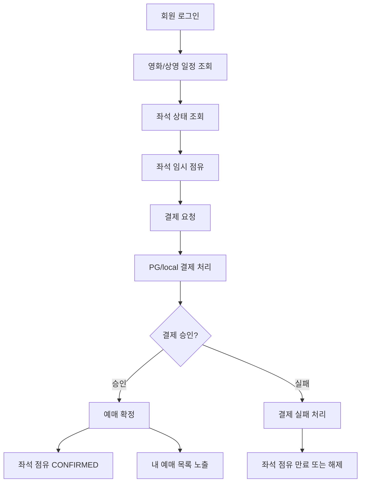

## 회원 가입

회원 가입은 휴대폰 인증을 선행 조건으로 합니다.

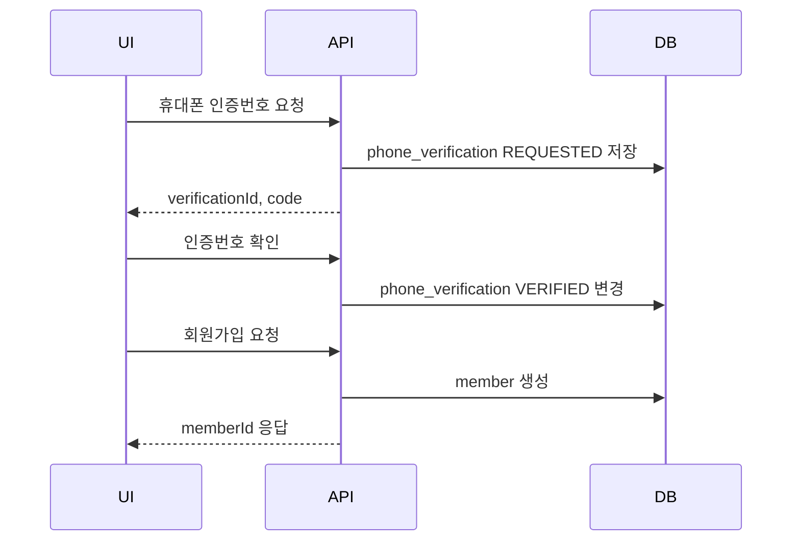

비즈니스 규칙:

- `user_id`와 `phone_number`는 중복될 수 없습니다.
- 회원 생성 전 휴대폰 인증이 완료되어야 합니다.
- 비밀번호는 hash로 저장하며 원문을 저장하지 않습니다.
- 회원 상태는 가입 시 활성 상태로 시작합니다.

예외 :
- 실제 본인인증 문자 발송은 구현되지 않았기 때문에 휴대폰 인증번호 요청 API 응답값에 code 가 포함되어 있습니다.

## 로그인/인증

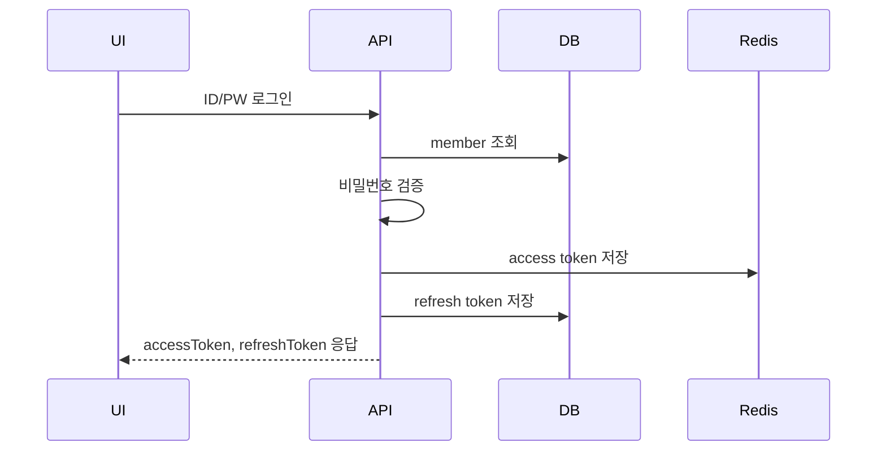

비즈니스 규칙:

- 탈퇴/잠금 회원은 로그인할 수 없습니다.
- 로그인 실패 횟수와 잠금 시각을 회원 상태 정책에 반영합니다.
- access token은 Redis에 저장하고, refresh token은 DB에 저장합니다.
- 로그아웃 시 access token과 refresh token을 무효화합니다.

## 영화/상영 조회

영화 목록과 상영 일정은 예매 진입점입니다.

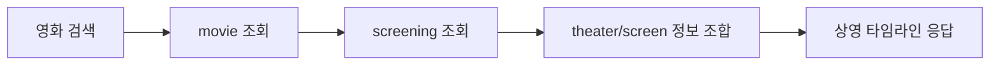

조회 기준:

- 영화 목록은 제목, 장르, 등급 검색을 지원합니다.
- 상영 일정은 영화, 상영관, 시작/종료 시각, 가격 정보를 포함합니다.
- 좌석 상태는 상영 ID 기준으로 별도 조회합니다.

## 좌석 상태 조회

좌석 상태는 확정 예매와 임시 점유를 합산해 계산합니다.

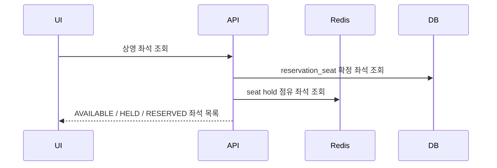

상태 의미:

| 상태 | 의미 |
|---|---|
| `AVAILABLE` | 선택 가능 |
| `HELD` | 다른 회원 또는 본인이 임시 점유 중 |
| `RESERVED` | 이미 예매 완료 또는 결제 확정 처리 중 |

계산 기준:

- DB의 `reservation_seat`에서 상영별 확정 좌석을 조회합니다.
- Redis의 `screening:{screeningId}:held_seats` SET에서 현재 임시 점유 좌석을 조회합니다.
- 두 결과를 합쳐 사용할 수 없는 좌석으로 응답합니다.
- 운영 환경에서 Redis `KEYS` 명령으로 점유 좌석을 찾지 않습니다.

## 좌석 임시 점유

좌석 선택은 Redis lock과 DB 이력을 함께 사용합니다.

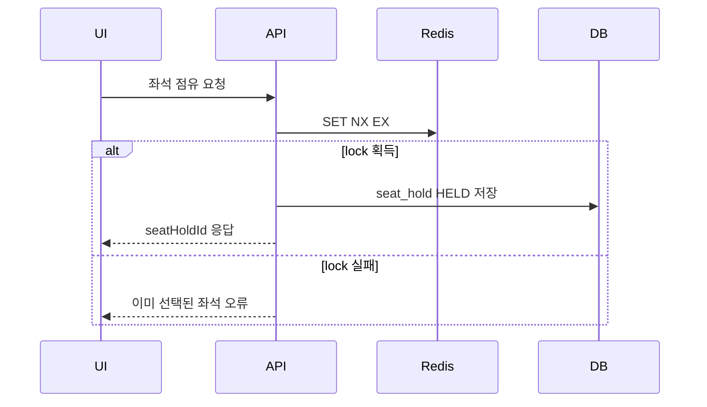

비즈니스 규칙:

- 같은 상영의 같은 좌석은 동시에 한 명만 점유할 수 있습니다.
- 점유 TTL은 환경 변수 `SEAT_HOLD_TTL_SECONDS`로 조절합니다.
- `seat_hold`는 이력 테이블이므로 같은 좌석의 과거 점유 기록을 보존합니다.
- 사용자가 결제 화면으로 가지 않고 이탈하면 좌석 점유 해제 API를 호출합니다.
- 브라우저 종료처럼 해제 API가 보장되지 않는 경우 Redis TTL과 만료 보정이 최종 정리를 담당합니다.

Redis 점유 기준:

| Redis 데이터 | 예시 | 역할 |
|---|---|---|
| 좌석 점유 key | `seat-hold:{screeningId}:{seatId}` | 좌석 클릭 순간의 단일 점유 lock |
| 좌석 점유 value | `{memberId}:{seatHoldId}` | 해제와 확정 시 DB 점유 이력 식별 |
| 좌석 점유 TTL | `SEAT_HOLD_TTL_SECONDS` | 결제 전 임시 점유 자동 만료 |
| 상영별 점유 SET | `screening:{screeningId}:held_seats` | 좌석 상태 조회 최적화 |

SET 멤버는 개별 TTL이 없으므로 명시적 해제, 만료 보정, 예매 확정 시 함께 정리합니다. Redis 장애 시에는 PostgreSQL의 `SELECT ... FOR UPDATE SKIP LOCKED` 기반으로 활성 `HELD` 점유를 확인하는 fallback을 둘 수 있습니다.

## 결제 요청

결제 요청은 좌석 점유를 기준으로 생성됩니다.

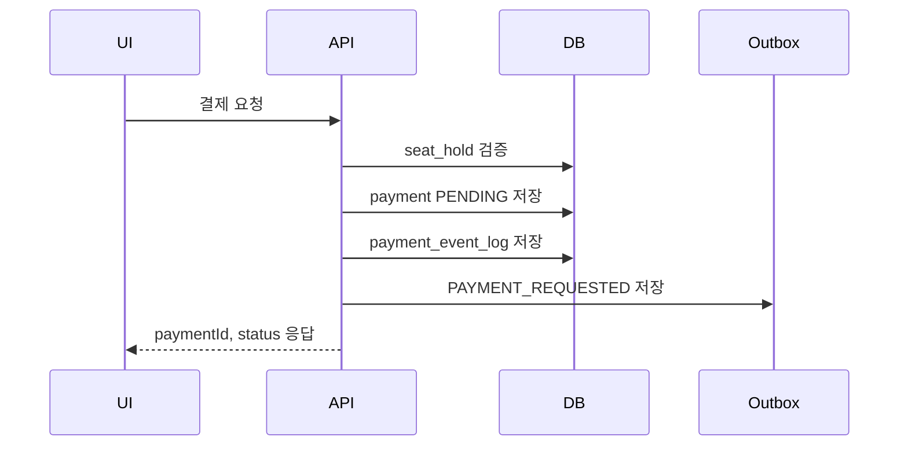

비즈니스 규칙:

- 결제 요청자는 좌석 점유 회원과 같아야 합니다.
- 좌석 점유 상태는 `HELD`여야 하며 만료되지 않아야 합니다.
- `member_id + idempotency_key`로 중복 결제 요청을 방지합니다.
- 같은 idempotency key로 다른 요청 본문이 들어오면 `request_hash`로 거부합니다.
- UI는 결제 요청 후 결제 상세 조회 API를 polling해 승인/실패 상태를 확인합니다.

멱등성 처리:

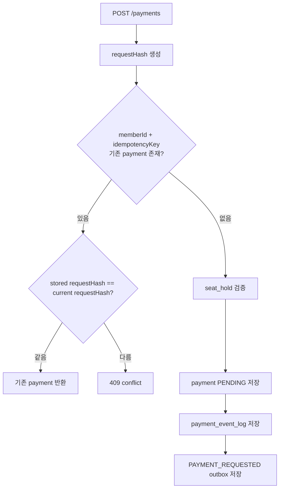

## 결제 승인 후 예매 확정

PG 또는 local payment callback은 결제를 승인하거나 실패 처리합니다. 승인 후에는 예매를 확정합니다.

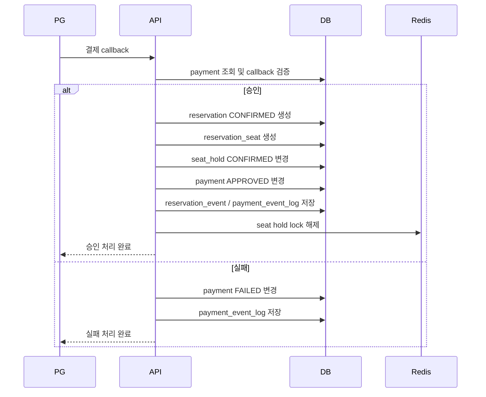

정합성 규칙:

- 예매 확정과 결제 승인 상태 변경은 같은 트랜잭션에서 처리합니다.
- `reservation_seat(screening_id, seat_id)` unique 제약이 중복 예매를 최종 차단합니다.
- Redis lock 해제는 DB 커밋 이후에 수행해야 합니다.
- 승인 후 내부 후처리가 실패하면 환불 필요 상태로 전환하고 환불 outbox를 남깁니다.
- PG 실패 callback은 `payment`를 `FAILED`로 바꾸고 결제 이벤트 로그만 남깁니다.
- PG 승인 후 예매 생성, 좌석 확정, 결제 승인 반영은 하나의 DB 트랜잭션에서 처리합니다.

승인 후 내부 후처리 실패 기준:

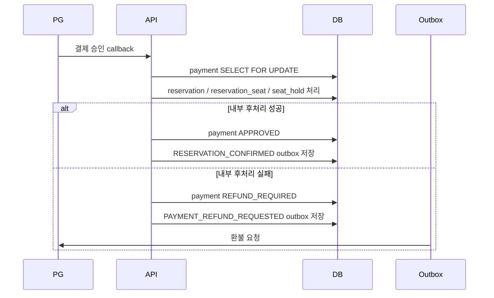

## 예매 취소와 환불

사용자는 관람 전 확정 예매를 취소할 수 있습니다.

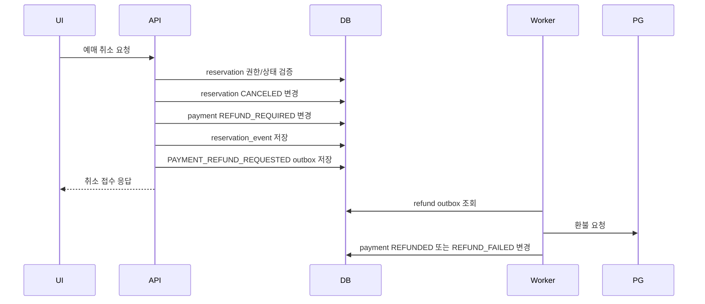

비즈니스 규칙:

- 본인 예매만 취소할 수 있습니다.
- 이미 취소된 예매나 관람 시작 이후 예매는 취소할 수 없습니다.
- 결제 상태가 환불 가능한 상태여야 합니다.
- 환불은 외부 provider 호출이 필요하므로 outbox worker가 후속 처리합니다.

## 결제 이벤트와 Outbox

결제 상태 변경 이력과 비동기 후속 작업은 분리해서 저장합니다.

| 저장소 | 역할 |
|---|---|
| `payment_event_log` | 결제 상태 변경 감사 로그. append-only로 저장 |
| `outbox_event` | 결제 요청, 환불 요청, 예약 확정 이벤트 같은 재시도 가능한 후속 작업 |

처리 규칙:

- 결제 상태 변경, 결제 이벤트 로그, outbox 저장은 같은 DB 트랜잭션에 포함합니다.
- outbox worker는 발행 가능한 이벤트를 잠근 뒤 성공하면 `PUBLISHED`, 실패하면 `FAILED`, `retry_count`, `next_retry_at`, `last_error`를 갱신합니다.
- 주요 결제 이벤트 타입은 `PAYMENT_REQUESTED`, `PAYMENT_CALLBACK_APPROVED`, `PAYMENT_APPROVED`, `PAYMENT_FAILED`, `PAYMENT_POST_PROCESSING_FAILED`, `PAYMENT_REFUNDED`, `PAYMENT_REFUND_FAILED`입니다.
- 주요 outbox 이벤트 타입은 `PAYMENT_REQUESTED`, `PAYMENT_REFUND_REQUESTED`, `RESERVATION_CONFIRMED`입니다.

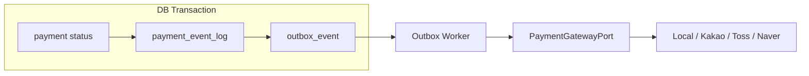

## 점유 만료와 해제

좌석 점유는 명시적 해제 또는 TTL 만료로 종료됩니다.

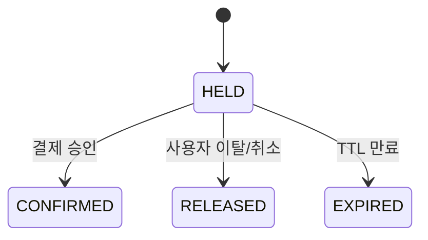

처리 기준:

- 명시적 해제는 Redis lock과 DB `seat_hold` 상태를 함께 정리합니다.
- TTL 만료는 Redis가 우선 처리하고, DB는 만료 보정 작업으로 `EXPIRED` 처리합니다.
- 결제 승인된 점유는 `CONFIRMED`로 전환하고 예매와 연결합니다.

## 내 예매 목록 조회

회원은 본인의 예매 목록을 최신순 커서 페이지네이션으로 조회합니다.

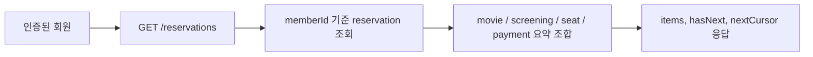

조회 규칙:

- 인증된 회원 본인의 예매만 조회합니다.
- 응답은 `limit`, `cursor` 기반으로 페이지를 나눕니다.
- UI의 관람 예정/관람 완료/취소 탭은 예매 상태와 상영 시작 시각으로 분류합니다.

## 상태 전이 요약

### `reservation.status`

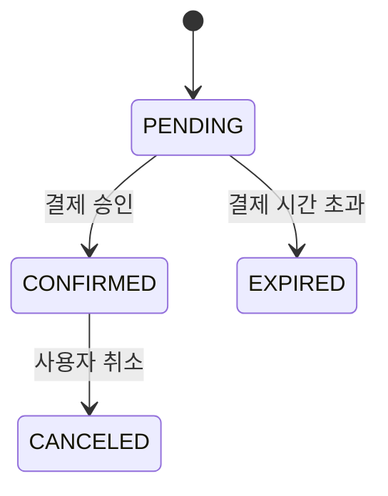

### `payment.status`

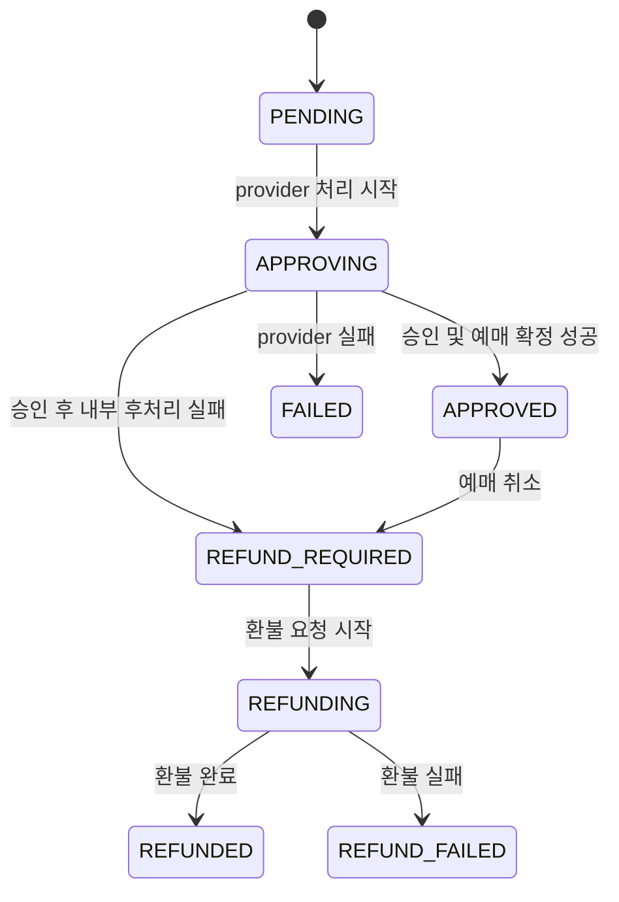

### `seat_hold.status`

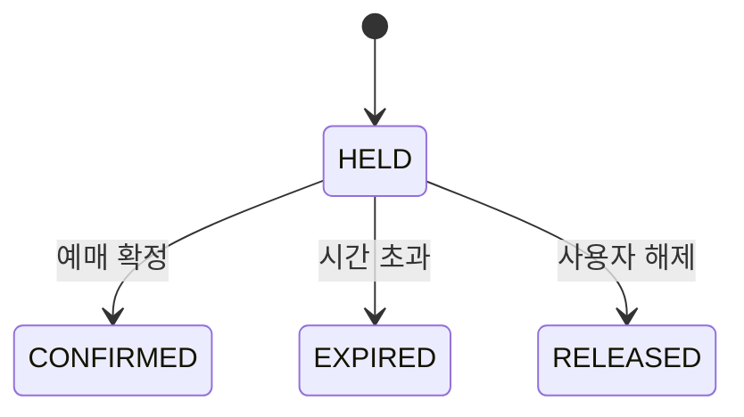
