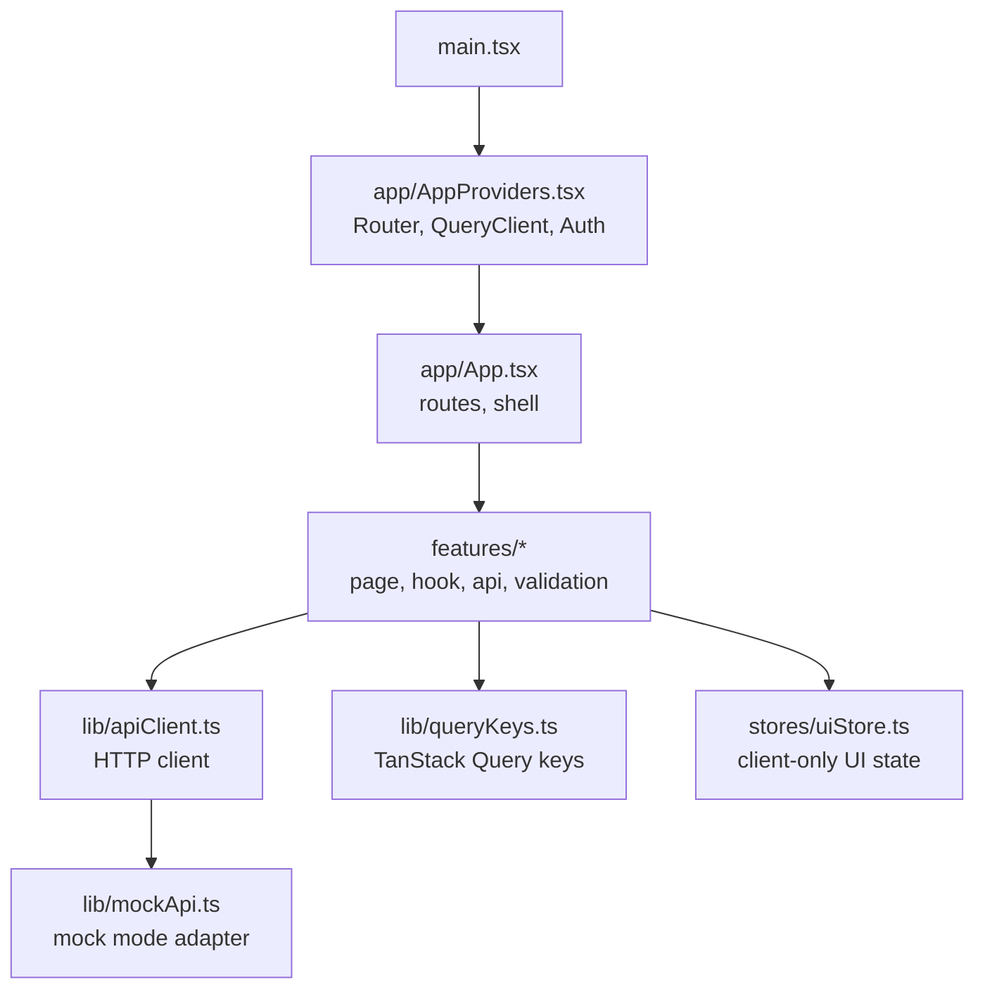
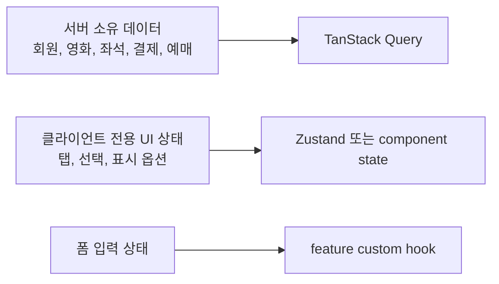

# UI 프로젝트 구조

React 19 + Vite 기반 프론트엔드의 디렉토리 구조와 책임을 설명합니다. 이 문서는 `src`, `test`, `docs`처럼 직접 유지보수하는 경로를 기준으로 하며, `dist`, `coverage`, `node_modules` 같은 생성 산출물은 제외합니다.

## 개요

UI는 feature 단위로 화면, API, 검증, 커스텀 훅을 묶습니다. 서버 상태는 TanStack Query가 소유하고, 클라이언트 전용 상태만 Zustand를 사용합니다. 컴포넌트와 페이지에는 렌더링 구성을 두고, 비즈니스 로직과 API orchestration은 feature별 커스텀 훅으로 분리합니다.

## 최상위 구조

| 경로 | 역할 |
|---|---|
| `src/main.tsx` | React 앱 진입점. |
| `src/app` | 라우팅, 전역 provider, 앱 shell 훅. |
| `src/components/ui` | 공통 UI primitive. 현재 `Button` 등 shadcn 스타일 wrapper를 둡니다. |
| `src/features` | 화면별 기능 모듈. 페이지, API, validation, 커스텀 훅을 함께 둡니다. |
| `src/lib` | API client, query key, mock mode, className helper 같은 공통 유틸. |
| `src/stores` | Zustand 기반 클라이언트 전용 상태. |
| `src/styles.css` | 앱 전역 스타일. |
| `test` | Vitest + happy-dom 테스트. |
| `docs` | UI 프로젝트 문서. |

## `src/app`

| 파일 | 역할 |
|---|---|
| `App.tsx` | React Router route 구성과 인증 보호 route. |
| `AppProviders.tsx` | 전역 provider 조립. |
| `useAppShell.ts` | 앱 shell의 인증/로그아웃 흐름을 담당하는 커스텀 훅. |

## `src/features`

각 feature는 같은 패턴을 따릅니다.

| 패턴 | 역할 |
|---|---|
| `*Page.tsx` | 화면 렌더링. 업무 로직은 직접 구현하지 않습니다. |
| `use*Page.ts` | 페이지 상태, TanStack Query, mutation, 이벤트 핸들러를 담당합니다. |
| `*Api.ts` | `src/lib/apiClient.ts`를 통한 API 호출 함수. |
| `*Validation.ts` | 입력 검증 규칙. |
| 기타 순수 모듈 | 필터링, 포맷팅, 선택 계산 등 테스트 가능한 순수 로직. |

현재 feature 구성은 다음과 같습니다.

| 경로 | 역할 |
|---|---|
| `features/auth` | 인증 provider와 내 정보 조회. 토큰 만료 시 로그인 화면으로 유도합니다. |
| `features/login` | ID/PW, 카카오, 네이버 로그인 화면과 로그인 API. |
| `features/signup` | 회원가입, ID 중복 검사, 휴대폰 인증, 주소 검색. |
| `features/movies` | 영화 타임라인 목록, 검색, 상영 정보 표시. |
| `features/seats` | 좌석 조회, 좌석 선택/점유, 점유 해제 흐름. |
| `features/payment` | 결제 요청, 결제 상태 확인 polling, 결제 요약. |
| `features/reservations` | 내 예매 목록, 커서 페이지네이션, 예매 취소. |
| `features/profile` | 내 정보, 내 예매내역 진입, 비밀번호 변경, 회원탈퇴. |

## `src/lib`

| 파일 | 역할 |
|---|---|
| `apiClient.ts` | 모든 API 요청의 단일 진입점. base URL, 인증 토큰, correlation id, 인증 오류 이벤트를 처리합니다. |
| `apiMode.ts` | `VITE_API_MODE`, `VITE_API_MOCK` 기반 mock/real API 모드 판단. |
| `mockApi.ts` | 로컬 개발용 mock API 응답. 실제 API 계약과 최대한 같은 형태를 유지합니다. |
| `queryKeys.ts` | TanStack Query key factory. 서버 상태 cache key는 이 파일에서 생성합니다. |
| `cn.ts` | className 병합 helper. |

## 상태 관리 기준

- 서버에서 가져오는 데이터는 TanStack Query로 관리합니다.
- 전역 공유가 필요 없는 화면 상태는 feature 커스텀 훅의 component state로 둡니다.
- Zustand는 서버 데이터 복제에 사용하지 않고, 클라이언트 전용 UI 상태에만 사용합니다.
- 페이지와 컴포넌트에는 `useQuery`, `useMutation`, `useState`, `useEffect` 기반 업무 로직을 직접 두지 않고 `use*Page` 훅으로 분리합니다.

## 테스트 구조

| 경로 | 역할 |
|---|---|
| `test/*Api.test.ts` | API client 호출 경로, 인증 헤더, 응답 매핑 검증. |
| `test/*Validation.test.ts` | 폼 검증 규칙 검증. |
| `test/*Filters.test.ts`, `test/*Selection.test.ts` | 순수 계산 로직 검증. |
| `test/use*Page.test.tsx` | feature 커스텀 훅의 주요 workflow 검증. |
| `test/setup.ts` | Vitest 공통 setup. |

## 작업 규칙

- 새 화면은 `features/<도메인>/<Page>.tsx`와 `use<Page>.ts`를 함께 설계합니다.
- API 함수는 feature 내부 `*Api.ts`에 두되, HTTP 호출은 반드시 `src/lib/apiClient.ts`를 통합니다.
- query key는 `src/lib/queryKeys.ts`에 추가합니다.
- mock 모드가 필요한 API는 `src/lib/mockApi.ts`에 실제 OpenAPI 응답에 가까운 형태로 추가합니다.
- OpenAPI 계약이 바뀌면 API 타입, 응답 매퍼, 관련 테스트를 함께 수정합니다.
